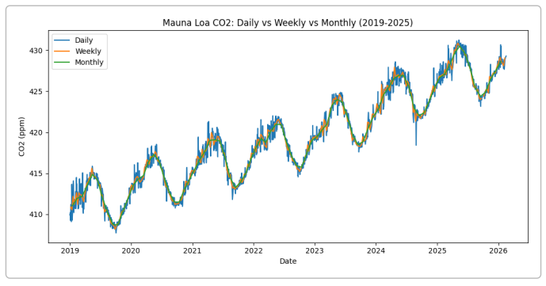
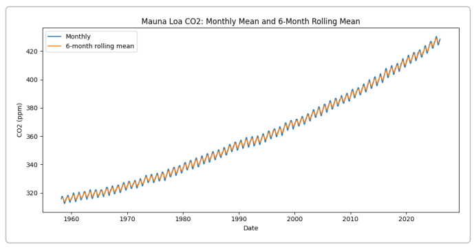
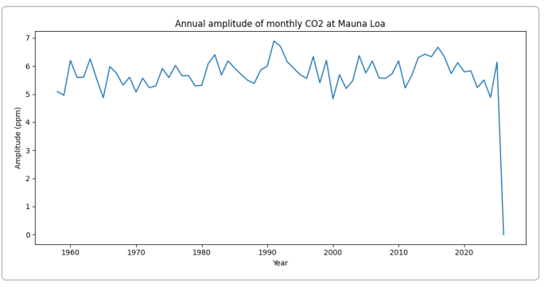
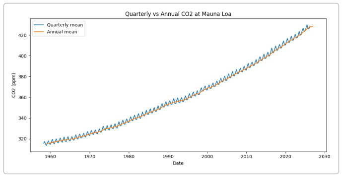
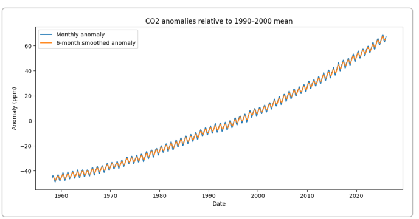
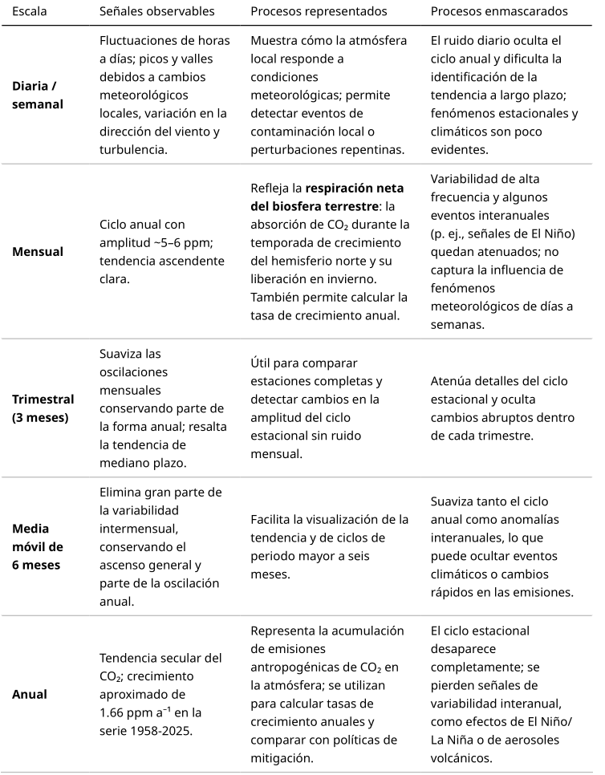

# Resolucion Inciso 1: Agregacion temporal y CO2

Introducción

Las mediciones de dióxido de carbono atmosférico (CO₂) en la estación de Mauna Loa (Hawái)  
constituyen uno de los registros más completos de la concentración de este gas. La Administración  
Nacional Oceánica y Atmosférica de Estados Unidos (NOAA) pone a disposición datos diarios,  
semanales, mensuales y anuales que permiten estudiar la evolución de la concentración y su  
variabilidad estacional y de largo plazo

Los archivos de la NOAA muestran que los datos se construyen a partir de promedios diarios y que en los primeros años (1958‑1974) se utilizaron mediciones del Instituto Scripps; los meses con valores faltantes son interpolados y se indica el número de días disponibles. El documento anual aclara que las mediciones más recientes pueden modificarse durante los controles de calidad y que las observaciones se suspendieron por la erupción del volcán Mauna Loa (29 de noviembre de 2022) hasta julio de 2023.

Analizaremos cómo la agregación temporal (escala de observación) modifica la señal observada en la serie de CO₂ de Mauna Loa. Utilizamos los conjuntos de datos de la NOAA para las escalas diaria, semanal, mensual y anual, y generamos además una escala adicional (promedio trimestral y media móvil de seis meses). También examinamos el significado físico de las variaciones en cada escala y discutimos qué procesos se enmascaran o se resaltan según la agregación.

**Preprocesamiento**: se convirtieron las columnas de año, mes y día en objetos de fecha ( datetime ) y se filtraron los valores faltantes codificados como −999.99. Los datos semanales y diarios comienzan en 1974, mientras que la serie mensual inicia en 1958. La serie diaria se promedia para obtener valores semanales y mensuales; las medias anuales se calculan promediando los meses.

**Cálculo de escalas agregadas**: además de las medias diarias, semanales y mensuales, se calculó un promedio trimestral (cada tres meses) y una media móvil de seis meses a partir de la serie mensual. Se escogió la escala trimestral porque reduce el efecto de variaciones mensuales (en particular la señal estacional) sin perder la tendencia de mediano plazo, y la media móvil de seis meses permite atenuar la variabilidad intermensual conservando el ciclo anual.

**Análisis de tendencias y amplitud**: se ajustó una regresión lineal simple ( y = a·t + b ) a cada serie para estimar la tasa de incremento (ppm a⁻¹). También se calculó la amplitud anual de la señal estacional como la diferencia entre el máximo y el mínimo mensual de cada año y se comparó entre décadas. Para estudiar las anomalías se restó a cada valor la media de 1990‑2000 (periodo de referencia) y se examinaron las desviaciones y su suavizado.

---

## Comparación entre escalas diaria, semanal y mensual

En la escala diaria (Figura 1) se observa ruido considerable debido a variaciones meteorológicas locales (cambios en la dirección del viento, presión y variabilidad diurna), instrumentación y condiciones de la atmósfera. Las medias semanales (Figura 1) suavizan ese ruido pero aún muestran oscilaciones de días a semanas.

> Figura 1 - concentraciones de CO₂ entre 2019 y 2025 para las escalas diaria, semanal y mensual

La media mensual (Figura 1) elimina gran parte de la variabilidad de alta frecuencia y permite apreciar con claridad el ciclo anual, caracterizado por un descenso en primavera–verano del hemisferio norte (mayor absorción de CO₂ por la vegetación) y un aumento durante otoño–invierno (respiración y descomposición vegetales). Este ciclo estacional tiene una amplitud media de aproximadamente 5–6 ppm y ha aumentado levemente desde la década de 1960 (de ~5.67 ppm en los años 60 a ~5.99 ppm en 2014‑2023).

---

## **Series mensuales y media móvil de seis meses**

La Figura 2 muestra la serie mensual completa (1958‑2025) y su media móvil de seis meses. La tendencia ascendente es evidente: la concentración mensual pasa de 315 ppm en 1958 a más de 423 ppm en 2025.

> Figura 2 - Serie Mensual de CO₂ entre 1958 y 2025 y Media Móvil de 6 Meses

La regresión lineal sobre toda la serie mensual arroja una tasa de aumento de ≈ 1.66 ppm a⁻¹, mientras que las series diaria y semanal (iniciadas en 1974) muestran pendientes algo mayores (1.87 ppm a⁻¹) debido al periodo de ajuste más corto, lo cual refleja la aceleración del crecimiento durante las últimas décadas. La media móvil de seis meses sigue fielmente la tendencia general y conserva la estructura del ciclo anual, pero filtra la mayoría de las oscilaciones mensuales.

---

## **Amplitud anual del ciclo estacional**

La (Figura 3) muestra la amplitud del ciclo anual (diferencia entre los valores máximos y mínimos mensuales de cada año) revelando la intensidad de los flujos biogénicos de CO₂.

> Figura 3 - Amplitud del ciclo anual

La figura muestra que la amplitud ha aumentado ligeramente desde la década de 1960 hasta principios de la década de 2020, un fenómeno vinculado a cambios en la productividad de los ecosistemas terrestres y en la fenología (por ejemplo, estaciones de crecimiento más largas). Sin embargo, los valores de 2022‑2023 son anómalamente bajos debido a la interrupción de datos por la erupción del volcán Mauna Loa y la relocalización temporal de la estación

---

## **Comparación entre promedios trimestrales y anuales**

La figura 4 compara el promedio trimestral (promedio de tres meses) con el promedio anual. Ambos muestran la tendencia ascendente de CO₂, pero el promedio anual elimina completamente la variabilidad estacional, por lo que el principal proceso visible es el incremento secular causado por las emisiones antropogénicas.

El promedio trimestral, en cambio, conserva parte del ciclo anual y puede ser útil cuando se desea representar datos con menos ruido que la serie mensual pero sin eliminar completamente el ciclo estacional. Agregar los datos a escalas superiores (por ejemplo, promedio de cinco o diez años) ayuda a enfocar la tendencia de fondo, pero también enmascara procesos interanuales relevantes, como las anomalías asociadas a El Niño, erupciones volcánicas o cambios en el forzamiento antropogénico.

---

## **Anomalías respecto al periodo de referencia 1990‑2000**  

Para evaluar desviaciones respecto a un nivel base, se calculó la anomalía de cada mes restando el  
promedio de 1990‑2000.

La figura 5 presenta las anomalías mensuales junto con una media móvil de  
seis meses. El resultado muestra un incremento casi lineal de las anomalías, con oscilaciones  
interanuales vinculadas a la variabilidad climática (por ejemplo, eventos de El Niño y La Niña). Las  
anomalías suavizadas resaltan la aceleración del aumento de CO₂ en el siglo XXI.

---

## **¿Qué procesos son observables y cuáles se enmascaran según la escala de agregación?**

---

## ¿Cuándo la agregación distorsiona la interpretación del proceso principal?  

El principal proceso reflejado por la concentración de CO₂ en Mauna Loa es el aumento sostenido debido a las emisiones antropogénicas. Este proceso se observa claramente en escalas mensuales o superiores. Sin embargo, la agregación excesiva puede distorsionar la interpretación en los siguientes casos:

  
• **Promedios anuales o multi‑anuales**: si se calcula la media de varios años (por ejemplo, promedios uinquenales o decenales) se obtiene una curva muy suave que oculta aceleraciones o desaceleraciones recientes. Esto podría inducir a subestimar la rapidez con la que aumenta el CO₂. En nuestro análisis, la pendiente lineal difiere entre escalas porque las series diaria y semanal comienzan en 1974 y captan una época de mayor crecimiento (~1.87 ppm a⁻¹), mientras que la serie mensual incluye décadas con menor tasa de incremento.

  
• **Promedios largos para evaluaciones de política**: el Panel Intergubernamental sobre Cambio Climático (IPCC) utiliza promedios móviles de 20 años para definir niveles de calentamiento y evitar la influencia de la variabilidad interanual 4 . Si se promediara a periodos más cortos (por ejemplo 1‑3 años), se correría el riesgo de confundir variabilidad natural (El Niño, erupciones volcánicas) con la tendencia antropogénica. Por otro lado, promediar en exceso (más de 20 años) retrasaría la detección de cambios importantes y afectaría la pertinencia de las recomendaciones de política climática.

  
• **Filtrado de alta frecuencia**: la media móvil de seis meses es útil para visualizar tendencias pero  
reduce la amplitud del ciclo estacional. Si el objetivo es estudiar los mecanismos biogeoquímicos  
del ciclo anual o la respuesta de la vegetación al clima, se debe evitar este tipo de filtrado porque  
oculta la interacción entre estaciones.

---

## ¿Qué escala temporal es relevante para las recomendaciones del IPCC AR6?

El IPCC AR6 utiliza promedios móviles de 20 años para evaluar el calentamiento global y determinar  
cuándo se superan umbrales de temperatura como 1.5 °C o 2 °C. El informe técnico señala que las  
estimaciones se basan en el cambio en la temperatura global promedio de 20 años (por ejemplo,  
2015‑2050) para diferentes escenarios y define el momento de cruce de un nivel de calentamiento  
como el punto medio del primer periodo de 20 años en que la temperatura media global supera dicho  
nivel. Además, se explica que la variabilidad decenal seguirá ocurriendo pero no afectará la  
tendencia centenaria. Por tanto, las recomendaciones de mitigación y las evaluaciones de progreso  
en el IPCC se formulan en escalas decenales a multi‑decenales, ya que son lo suficientemente largas  
para filtrar la variabilidad interanual y reflejar las tendencias antropogénicas.

---

# **Procesos físicos enmascarados según la escala**  

• **Variabilidad meteorológica**: en las series diarias y semanales los valores de CO₂ fluctúan por cambios en la circulación local (brisas, turbulencia) y la altura de la capa límite. Estas perturbaciones se promedian en escalas mensuales y mayores.

  
• **Ciclo estacional**: en escalas mensuales se observa la respiración neta de la biosfera del hemisferio norte. La agregación a escalas trimestrales o anuales enmascara este proceso, impidiendo analizar la fenología o la respuesta de los ecosistemas al cambio climático.

  
• **Eventos interanuales**: fenómenos como El Niño o erupciones volcánicas afectan la concentración de CO₂ a escala de meses a años; por ejemplo, el documento de la NOAA advierte que las mediciones se suspendieron durante la erupción del volcán Mauna Loa. Estos eventos se diluyen al promediar en periodos muy largos, pero pueden ser relevantes para entender las interacciones entre el ciclo del carbono y el clima.

  
• **Variabilidad de los sumideros**: la sección 5.2.1 del informe del IPCC indica que la variabilidad interanual y decenal de los sumideros oceánicos y terrestres es sensible a los cambios en el crecimiento de las emisiones y al clima . Esta variabilidad no se aprecia en escalas anuales, pero es importante para estimar la capacidad de los sumideros y la retroalimentación climática.

---

## Conclusiones  

• El análisis de las series de CO₂ de Mauna Loa demuestra que la escala temporal utilizada influye  
notablemente en la interpretación de los datos. Las series diarias y semanales están dominadas  
8por ruido y por procesos locales de alta frecuencia, mientras que las series mensuales permiten  
observar el ciclo estacional y la tendencia secular. La media móvil de seis meses y los promedios  
trimestrales suavizan el ciclo anual y ayudan a visualizar la tendencia, pero pueden ocultar  
anomalías interanuales.

  
• La tasa de incremento del CO₂ en Mauna Loa ha aumentado con el tiempo; en la serie mensual  
completa (1958‑2025) la pendiente es ~1.66 ppm a⁻¹, mientras que en las series diarias y  
semanales (desde 1974) asciende a ~1.87 ppm a⁻¹, indicando una aceleración reciente. La  
amplitud del ciclo anual también ha crecido ligeramente, lo que sugiere cambios en la  
productividad y la fenología terrestres.  

• Según el IPCC AR6, las evaluaciones de calentamiento se realizan con promedios de 20 años y se  
definen los cruces de niveles (1.5 °C, 2 °C) como el punto medio del primer periodo de 20 años  
que excede el valor 8 . Por lo tanto, las decisiones de política climática se basan en escalas  
decenales a multi‑decenales, suficientemente largas para filtrar la variabilidad interanual y  
capturar la tendencia antropogénica.  

• La elección de la escala de agregación debe responder a la pregunta científica o de gestión: para  
estudiar la fisiología de la biosfera y su respuesta al clima, es imprescindible conservar el ciclo  
estacional y evitar promedios largos; para evaluar el éxito de las políticas de mitigación o prever  
el calentamiento global, se requiere promediar en escalas de décadas. La combinación de  
distintas escalas permite comprender los procesos ambientales en toda su complejidad.
