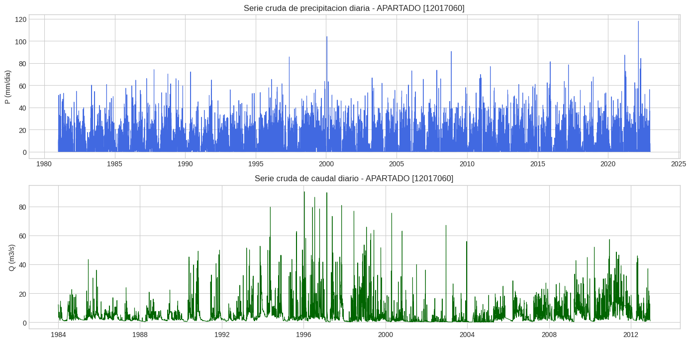
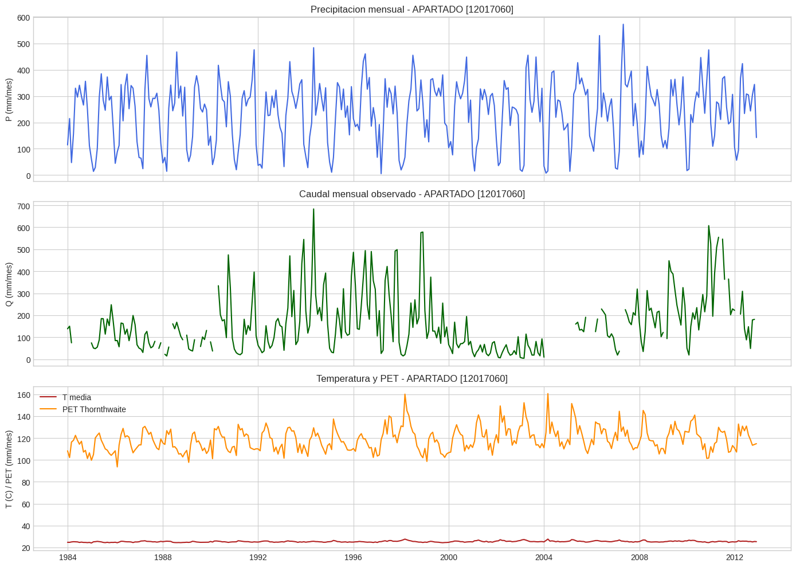
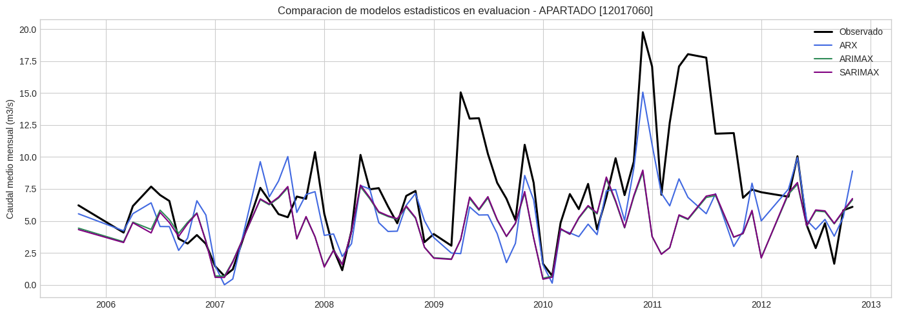
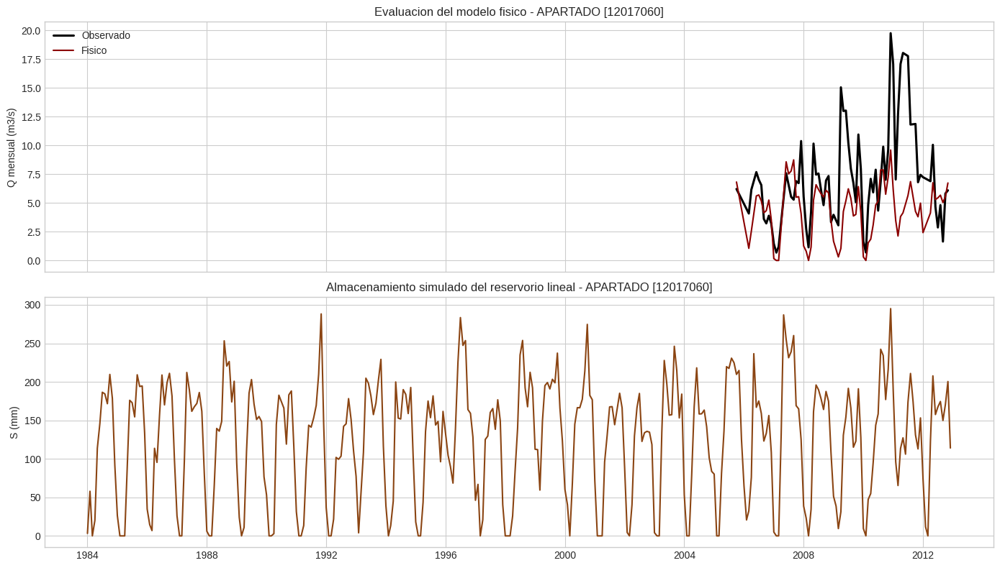
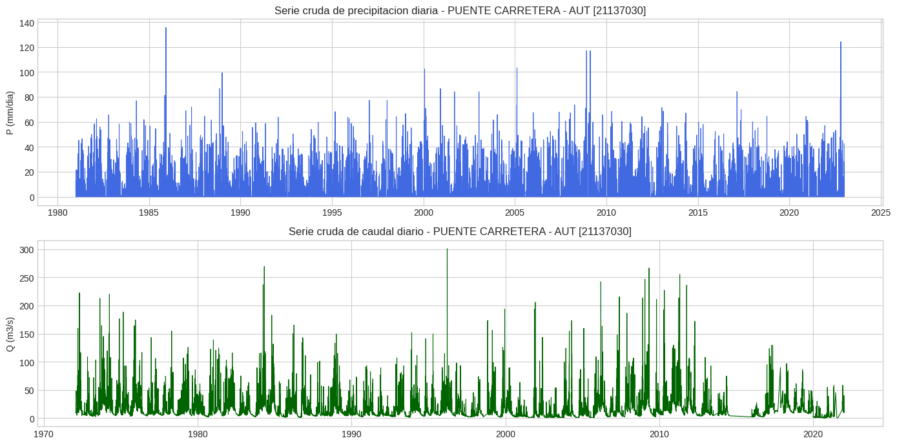
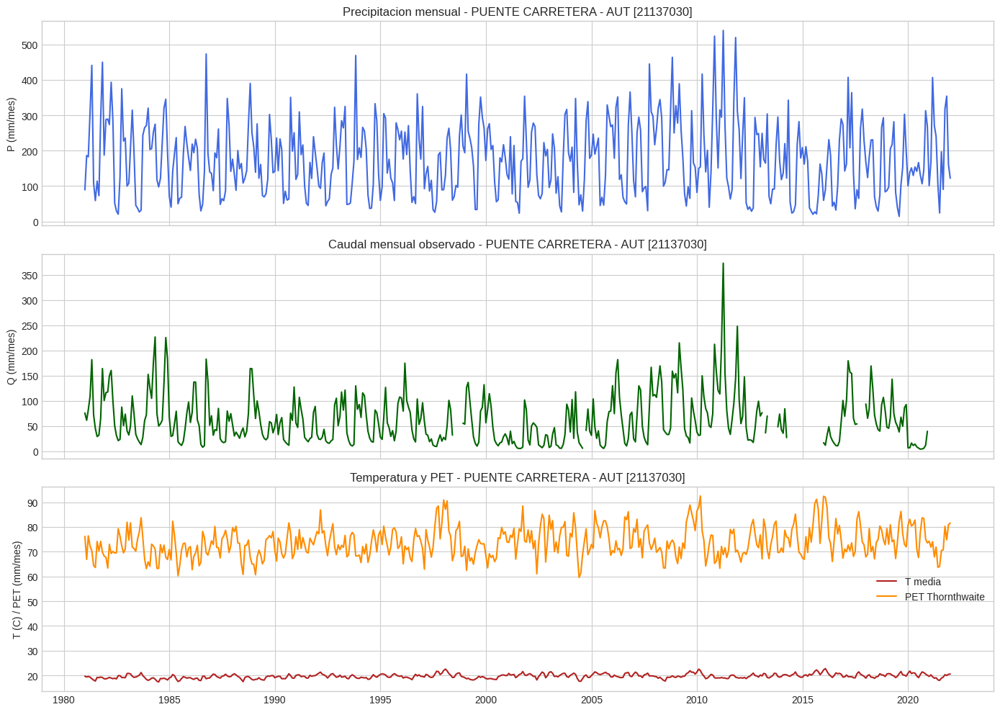
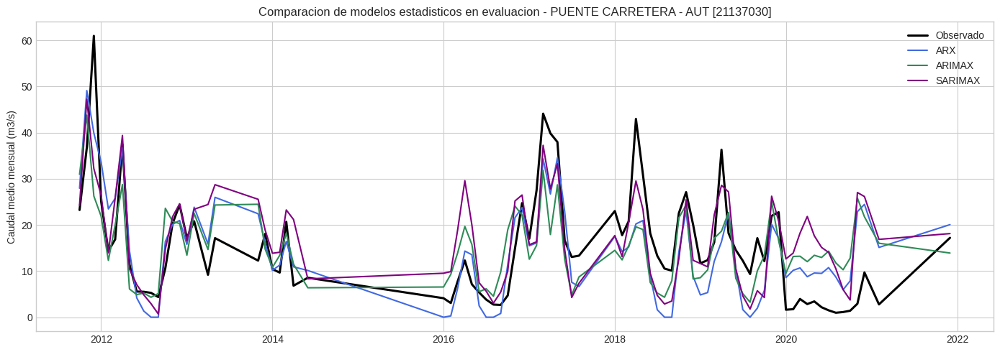
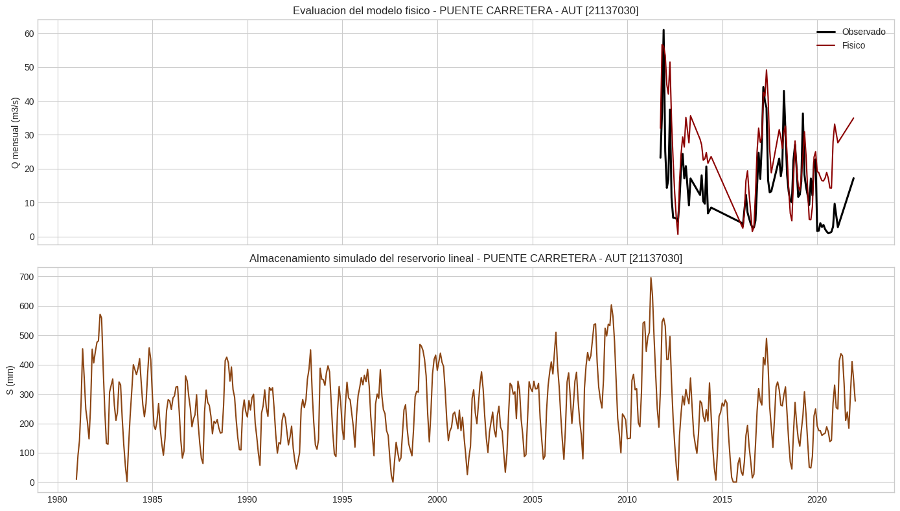

# Resolucion Inciso 3: Modelos lineales vs procesos

:::{dropdown} Introduccion
En este inciso se comparan modelos estadisticos y un modelo basado en procesos para predecir el caudal mensual en dos cuencas colombianas: `APARTADO [12017060]` y `PUENTE CARRETERA - AUT [21137030]`.

La resolucion sigue el mismo flujo en ambas cuencas:

1. inspeccion de precipitacion diaria y caudal diario crudos,
2. agregacion mensual,
3. conversion del caudal a lamina equivalente en `mm/mes`,
4. estimacion de PET con Thornthwaite a partir de temperatura mensual NASA POWER,
5. division cronologica `75/25`,
6. ajuste de `ARX(3,1)`,
7. prueba de candidatos `ARIMAX` y `SARIMAX`,
8. calibracion de un modelo fisico de balance de agua con reservorio lineal,
9. comparacion final de desempeno.
:::

:::{dropdown} Fundamento del modelo basado en procesos
El esquema fisico usado fue:

`dS/dt = P - ET - Q`

con una formulacion mensual discreta:

- `S_(t+1) = S_t + P_t - ET_t - Q_t`
- `Q_t = k S_t`

La aproximacion `dS/dt ~ 0` en el largo plazo se justifica porque, al analizar periodos multianuales, el almacenamiento medio de la cuenca no crece ni decrece indefinidamente. Por eso, el balance medio de entradas y salidas tiende a cerrarse.

La `ET` se aproximo con PET de Thornthwaite usando temperatura mensual de NASA POWER. Esta decision es coherente con el caracter docente del ejercicio y con la disponibilidad de una fuente externa ligera y reproducible, aunque simplifica la demanda atmosferica real.
:::

## Cuenca 1: APARTADO [12017060]

### Exploracion de series crudas

La cuenca APARTADO tiene un area aproximada de `87.186 km2`. La serie mensual final cubre `1984-01` a `2012-12`, con `348` meses totales y `308` meses validos luego de imponer cobertura diaria minima de `90%` en el caudal.

### Precipitacion, caudal mensual y PET

Resumen hidrologico:

- precipitacion mensual media: `237.4 mm/mes`
- PET media Thornthwaite: `118.8 mm/mes`
- caudal mensual observado medio: `158.9 mm/mes`

### Modelos estadisticos

Se comparo el modelo base `ARX(3,1)` con familias `ARIMAX` y `SARIMAX` usando precipitacion exogena. En evaluacion:

- `ARX(3,1)`: `RMSE = 114.62`, `NSE = 0.205`, `corr = 0.610`
- mejor `ARIMAX`: `ARIMAX(2,0,1)` con `RMSE = 134.54`, `NSE = -0.095`
- mejor `SARIMAX`: `SARIMAX(1,0,0)x(1,0,0,12)` con `RMSE = 133.96`, `NSE = -0.086`

En esta cuenca, el modelo `ARX(3,1)` fue superior a todos los candidatos ARIMA probados.

### Modelo fisico

El mejor parametro del modelo fisico fue `k = 0.500`. En evaluacion:

- fisico: `RMSE = 144.23`, `NSE = -0.258`, `corr = 0.418`

El modelo fisico fue el menos preciso en esta cuenca, lo que sugiere que un solo reservorio lineal es demasiado simple para representar su dinamica hidrologica.

## Cuenca 2: PUENTE CARRETERA - AUT [21137030]

### Exploracion de series crudas

La cuenca PUENTE tiene un area aproximada de `658.750 km2`. La serie mensual final cubre `1981-01` a `2022-01`, con `493` meses totales y `447` meses validos con la misma regla de cobertura.

### Precipitacion, caudal mensual y PET

Resumen hidrologico:

- precipitacion mensual media: `177.3 mm/mes`
- PET media Thornthwaite: `73.8 mm/mes`
- caudal mensual observado medio: `62.6 mm/mes`

### Modelos estadisticos

En evaluacion:

- `ARX(3,1)`: `RMSE = 32.60`, `NSE = 0.513`, `corr = 0.736`
- mejor `ARIMAX`: `ARIMAX(1,0,0)` con `RMSE = 36.85`, `NSE = 0.377`
- mejor `SARIMAX`: `SARIMAX(1,0,1)x(0,1,1,12)` con `RMSE = 36.06`, `NSE = 0.404`

En esta cuenca las familias ARIMA mostraron mejor comportamiento que en APARTADO, pero no superaron al `ARX(3,1)`.

### Modelo fisico

El mejor parametro del modelo fisico fue `k = 0.290`. En evaluacion:

- fisico: `RMSE = 49.47`, `NSE = -0.122`, `corr = 0.712`

Aunque el modelo fisico mantiene una narrativa hidrologica clara en terminos de almacenamiento y recesion, no fue competitivo frente a los modelos lineales en precision predictiva.

## Comparacion transversal entre cuencas

| Cuenca | Mejor modelo | RMSE mejor | NSE mejor | RMSE ARX | RMSE fisico |
| --- | --- | ---: | ---: | ---: | ---: |
| APARTADO [12017060] | Estadistico ARX(3,1) | 114.617 | 0.205 | 114.617 | 144.226 |
| PUENTE CARRETERA - AUT [21137030] | Estadistico ARX(3,1) | 32.601 | 0.513 | 32.601 | 49.466 |

## Conclusiones

1. En las dos cuencas evaluadas, el mejor modelo fue `ARX(3,1)`.
2. La memoria hidrologica explicita mediante rezagos de caudal fue mas efectiva que las formulaciones `ARIMAX/SARIMAX` probadas.
3. El modelo fisico fue el menos competitivo en precision predictiva, aunque sigue siendo el mas interpretable desde el punto de vista hidrologico.
4. El resultado no invalida el enfoque basado en procesos; indica que la formulacion usada fue demasiado parsimoniosa para representar adecuadamente ambas cuencas.
5. Para este ejercicio y estos datos, un modelo lineal bien especificado puede superar a un modelo fisico simple cuando el objetivo principal es la prediccion fuera de muestra.
