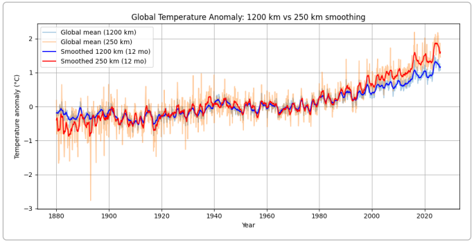
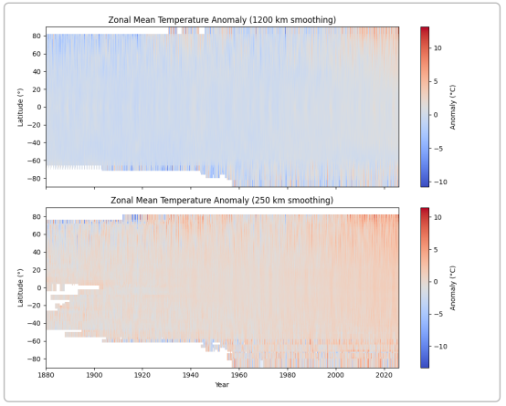
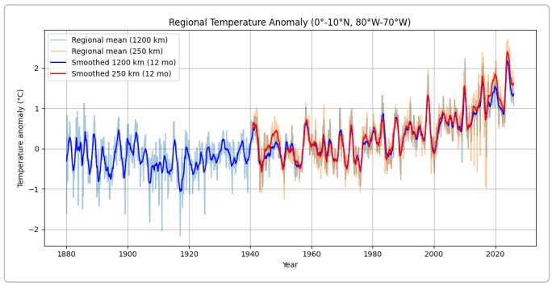

# Resolucion Inciso 2: Agregacion espacial global

:::{dropdown} Introduccion
La temperatura superficial del planeta no se mide de la misma manera en todas partes ni con la misma densidad espacial. En el producto **GISTEMP** del Instituto Goddard (NASA) se combinan las temperaturas del aire de estaciones terrestres (GHCN-M v4) con las anomalias de la temperatura del mar de ERSSTv5, y se interpolan mediante ponderacion lineal inversa para generar un conjunto de datos global en una cuadricula de 2 x 2 grados https://climatedataguide.ucar.edu/climate-data/global-surface-temperature-data-gistemp-nasa-goddard-institute-space-studies-giss#:~:text=Comparison%20of%20GISTEMP%20with%20climate,ocean%20and%202%20m%20air. Para rellenar las celdas vacias se emplea un radio de correlacion espacial de **1200 km**; existe una version alternativa que restringe la interpolacion a **250 km**. El producto ofrece anomalias de temperatura respecto al periodo 1951-1980, pero no valores absolutos, lo que reduce la incertidumbre y permite comparar regiones distintas.

En esta actividad se exploran los efectos de la resolucion espacial en las anomalias de temperatura superficial comparando los datos suavizados a 1200 km y a 250 km. Se analizan tres escalas espaciales:

1. **Promedio global** (ponderado por area).
2. **Media zonal** (promedio por latitud), que revela variaciones latitudinales.
3. **Promedio regional** para un area cercana a Medellin, Colombia (0-10 °N, 80-70 °W).

Se estudian las diferencias en magnitud de las anomalias y su varianza en cada escala y resolucion. Al final se ofrece una guia practica para reproducir el analisis en un cuaderno de Jupyter.
:::

:::{dropdown} Datos
Los archivos se obtienen desde la pagina de **GISTEMP**. En la seccion de descargas, NASA ofrece archivos NetCDF comprimidos con las anomalias mensuales en una cuadricula 2°x2°. Se distinguen dos productos relevantes:

| Producto (NetCDF) | Cobertura | Descripcion |
| --- | --- | --- |
| **Land-Ocean Temperature Index, ERSSTv5, 1200 km smoothing** | 1880-2026 | Combina estaciones terrestres y SST; usa un radio de 1200 km para interpolar estaciones hasta cubrir el oceano. (https://climatedataguide.ucar.edu/climate-data/global-surface-temperature-data-gistemp-nasa-goddard-institute-space-studies-giss#:~:text=Comparison%20of%20GISTEMP%20with%20climate,ocean%20and%202%20m%20air) |
| **Surface air temperature (no ocean data), 250 km smoothing** | 1880-2026 | Utiliza solo estaciones terrestres y aplica un radio maximo de 250 km para la interpolacion. (https://data.giss.nasa.gov/gistemp/#:~:text=Gridded%20Monthly%20Temperature%20Anomaly%20Data) |

Ambos archivos proporcionan **anomalias mensuales** respecto al promedio 1951-1980; no se incluyen valores absolutos. La resolucion espacial difiere en el radio de interpolacion, por lo que el producto de 1200 km suaviza mas las diferencias locales que el de 250 km.
:::

:::{dropdown} Metodologia
1. **Descarga y preparacion de los datos**:
   - Se descargaron los archivos `gistemp1200.nc.gz` y `gistemp250.nc.gz` desde la pagina de GISTEMP y se descomprimieron (`gunzip`) en el directorio de trabajo. Cada archivo contiene una variable `tempanomaly(time, lat, lon)` que representa la anomalia en °C.
   - Se utilizo la biblioteca **xarray** para abrir los archivos NetCDF y la biblioteca **numpy** para realizar operaciones numericas.
2. **Calculo del promedio global**:
   - Las celdas se ponderaron por el coseno de la latitud para aproximar el area de cada celda. Para cada mes, se calculo el promedio ponderado por area sobre todas las celdas validas del mundo. Esta operacion se realizo por separado para los datos de 1200 km y 250 km.
   - Se calculo la **media movil de 12 meses** para resaltar la tendencia de largo plazo.
3. **Calculo de la media zonal**:
   - Se promedio la anomalia sobre todas las longitudes para cada latitud y mes, obteniendo una serie temporal por banda de latitud. Esto permite observar la variacion meridional de las anomalias.
4. **Calculo del promedio regional**:
   - Se selecciono una region cercana a Medellin (0-10 °N, 80-70 °W). La seleccion incluyo tanto celdas de tierra como de mar en el producto de 1200 km; en el producto de 250 km (solo terrestre) algunas celdas en este dominio estan vacias. Se aplico un promedio ponderado por area sobre las celdas validas.
5. **Medidas estadisticas**:
   - **Amplitud**: diferencia entre el maximo y el minimo de la serie temporal, que indica el rango total de variacion.
   - **Varianza**: dispersion de la serie respecto a su media, calculada como la varianza temporal de las anomalias. Se utiliza como indicador de variabilidad.
:::

# Resultados y Discusiones

## Promedio global

En la figura siguiente se comparan las anomalías de temperatura global obtenidas con los productos de **1200 km** (línea azul) y **250 km** (línea roja), junto con su media móvil de 12 meses:

**Observaciones principales:**

- Las series muestran una tendencia de calentamiento sostenido desde finales del siglo XIX hasta la actualidad, con un incremento notable a partir de la década de 1970. Esta tendencia de largo plazo es coherente entre ambos productos y revela el calentamiento global.
- El producto de **1200 km** suaviza la variabilidad interanual porque utiliza un radio de interpolación amplio y promedia datos de océano y tierra. El producto de **250 km**, al basarse únicamente en estaciones terrestres y utilizar un radio de interpolación menor, presenta fluctuaciones más fuertes (mayor ruido) y una desviación anual más pronunciada.
- En términos de variabilidad, el producto de 250 km presenta una respuesta más intensa: la **amplitud global** aumenta de **2.36 °C** (1200 km) a **4.95 °C** (250 km), y la **varianza temporal** de **0.18** a **0.40**. Este comportamiento es consistente con un menor suavizado espacial, que preserva con mayor fuerza la variabilidad local e interanual. 

## Media zonal
Los diagramas tiempo-latitud evidencian diferencias claras en estructura espacial. El producto de 1200 km exhibe patrones más continuos y transiciones latitudinales más suaves, mientras que el de 250 km muestra una textura más irregular, con mayor contraste espacial y temporal. Esto es coherente con el radio de interpolación más corto y con la naturaleza terrestre del producto 250 km.

El mapa de calor siguiente muestra cómo varían las anomalías de temperatura según la latitud y el tiempo para ambas resoluciones. Cada pixel representa la media sobre todas las longitudes en un mes dado; los valores rojos indican anomalías cálidas y los azules, frías:

**Interpretación:**

- En el producto de **1200 km** el patrón espacial es más continuo; las anomalías negativas y positivas se distribuyen de manera más uniforme y se observa claramente el calentamiento acelerado del Ártico (latitudes altas) en las últimas décadas. La interpolación a gran escala permite extender la información hasta zonas donde no hay estaciones, como los océanos y la Antártida.
- En el producto de **250 km** se aprecian bandas más irregulares y variaciones locales más marcadas. Debido a la limitación de 250 km, aparecen lagunas en regiones oceánicas y las transiciones latitudinales son menos suaves. Esto hace evidente la heterogeneidad regional y eventos climáticos como El Niño y La Niña.
- La amplitud y varianza medias de las series zonales (promedio de todas las latitudes) son mayores para el producto de 250 km (véase tabla 1), lo que confirma que una menor suavización resalta la variabilidad: 
Al resumir cuantitativamente la variabilidad zonal (promediando amplitud y varianza de las series por latitud), se obtiene:

- **1200 km**: amplitud media zonal **6.73 °C**, varianza media zonal **1.19**
- **250 km**: amplitud media zonal **8.74 °C**, varianza media zonal **1.66**

Por tanto, la escala de 250 km resalta mayor heterogeneidad meridional y mayor variabilidad temporal por banda latitudinal.

## Promedio regional (Medellín, Colombia)

Para ilustrar el impacto de la resolución en una región concreta, se calculó la anomalía media dentro de 0–10 °N y 80–70 °W (incluye la región andina colombiana y parte del Caribe). El producto de 1200 km incluye celdas de océano y tierra; el de 250 km solo estaciones terrestres. En la figura se comparan ambas series:

Los resultados regionales muestran:

- **1200 km**: amplitud **4.51 °C**, varianza **0.39**
- **250 km**: amplitud **3.96 °C**, varianza **0.46**

**Comentarios:**

- La serie regional del producto de **1200 km** muestra variaciones estacionales relacionadas con ciclos oceánicos (p. ej., El Niño–Oscilación del Sur) y mantiene coherencia con el calentamiento global. Su amplitud es mayor porque incorpora zonas oceánicas y terrestres; sin embargo, el efecto de la interpolación larga suaviza extremos locales.
- El producto de **250 km** solo dispone de observaciones terrestres; la serie presenta huecos donde no hay estaciones y muestra menor amplitud pero mayor varianza (ruido) porque no se promedian condiciones del océano circundante. Esta diferencia evidencia cómo la selección del dominio (terrestre vs. combinado) afecta la interpretación.

### Tabla 1. Resumen de magnitud y variabilidad

| Escala y resolución | Amplitud total (°C) | Varianza temporal |
| --- | --- | --- |
| **Promedio global, 1200 km** | ~2.36 | ~0.18 |
| **Promedio global, 250 km** | ~4.95 | ~0.40 |
| **Media zonal (promedio de latitudes), 1200 km** | ~6.73 | ~1.19 |
| **Media zonal (promedio de latitudes), 250 km** | ~8.74 | ~1.66 |
| **Promedio regional (0–10 °N, 80–70 °W), 1200 km** | ~4.51 | ~0.39 |
| **Promedio regional (0–10 °N, 80–70 °W), 250 km** | ~3.96 | ~0.46 |

La tabla muestra que al reducir el radio de interpolación (250 km), la **varianza** aumenta lo que indica mayor variabilidad local. La **amplitud** también tiende a aumentar en la media zonal y global para la versión de 250 km, aunque en la región específica fue ligeramente menor porque el producto de 250 km carece de datos oceánicos. **Estos resultados destacan que la resolución espacial influye no solo en la representación de eventos extremos y fluctuaciones locales, sino también en la interpretación de la variabilidad clímatica y de las tendencias**.

## ¿Qué procesos son observables o se enmascaran?

- **Tendencia de calentamiento global:** es claramente visible en cualquier escala, especialmente en los promedios globales y zonales. La interpolación a 1200 km facilita una cobertura casi completa del planeta, lo que permite detectar la señal de calentamiento con menor ruido.
- **Variabilidad regional y extrema:** la versión de 250 km resalta la variabilidad local porque las anomalías de estaciones cercanas no se promedian con puntos lejanos. Esto permite identificar eventos regionales (ondas de calor, frentes fríos) y fenómenos como El Niño/La Niña, pero también introduce mayor dispersión y huecos.
- **Fenómenos de alta latitud:** la interpolación amplia de 1200 km extiende la información a zonas polares, capturando el rápido calentamiento del Ártico. La versión de 250 km no consigue cubrir extensiones heladas con pocas estaciones, por lo que enmascara parte del calentamiento polar.
- **Efectos de la selección del dominio:** para la región cercana a Medellín, la inclusión o exclusión del océano cambia la amplitud de las anomalías. La señal regional del producto combinado (1200 km) refleja tanto la influencia marina como la terrestre; en cambio, el producto terrestre (250 km) se centra en unas pocas estaciones y amplifica las oscilaciones al carecer de promediado oceánico.

## Conclusiones

El análisis demuestra que la **resolución espacial** influye de manera significativa en la representación de las anomalías de temperatura. La versión de 1200 km proporciona una visión global más estable al interpolar ampliamente y mezclar información de océano y tierra, lo que hace énfasis en la tendencia de calentamiento global. La versión de 250 km, aunque más ruidosa, permite explorar la variabilidad regional y detectar eventos locales que podrían quedar enmascarados al promediar sobre grandes distancias. La selección del dominio (global, zonal, regional) y del producto (1200 km vs 250 km) debe adaptarse al objetivo del análisis: estudiar tendencias de largo plazo o evaluar impactos regionales.