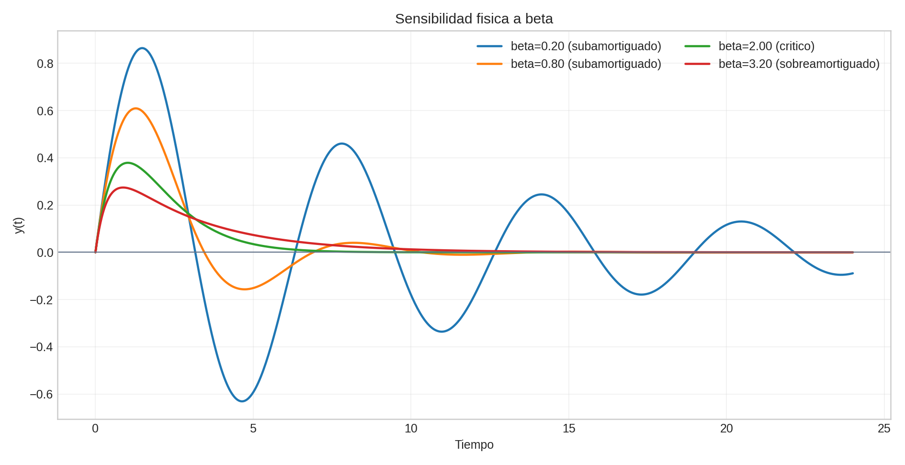
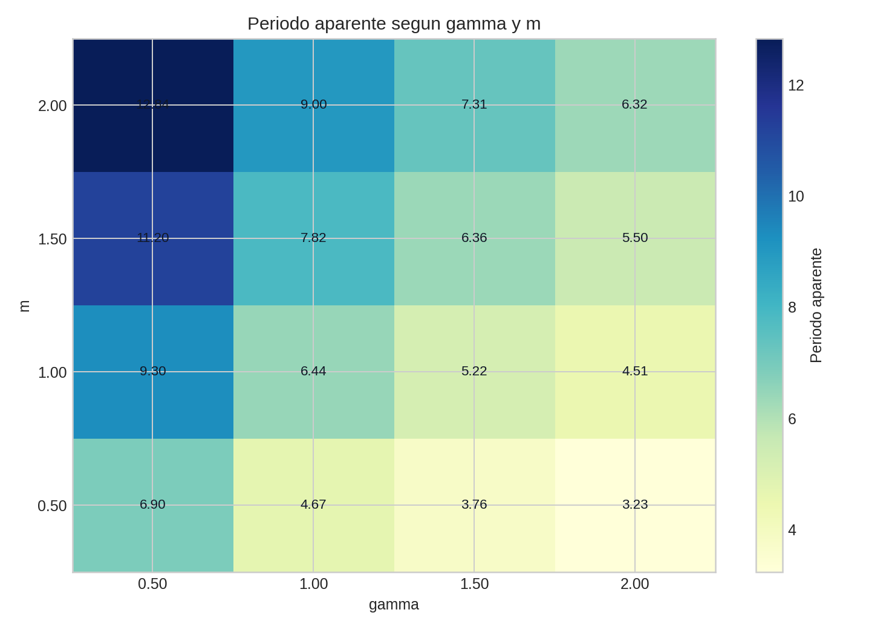
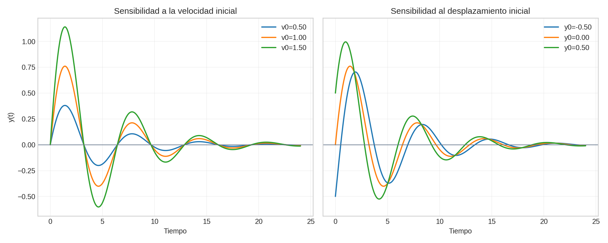
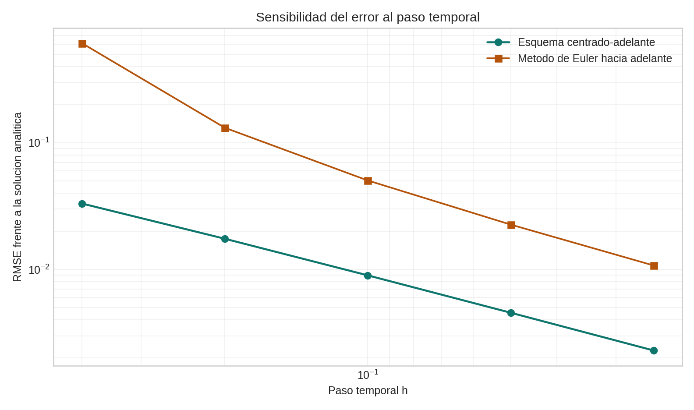
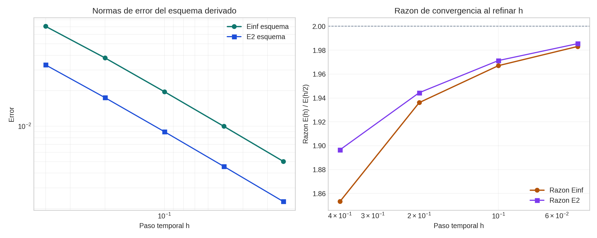
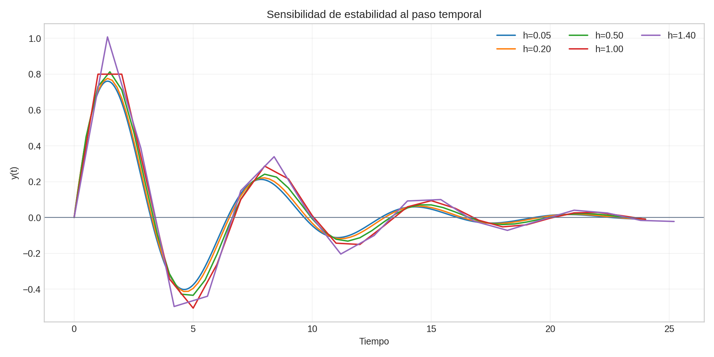
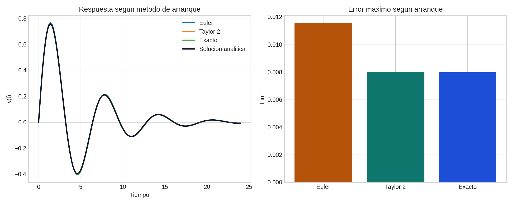

# Analisis de sensibilidad: Globo de medicion de variables meteorologicas

## Proposito del analisis
En este apartado se separa la sensibilidad del modelo fisico de la sensibilidad de la solucion numerica. Esta distincion es importante porque no todos los cambios observados en `y(t)` provienen de la fisica del globo: algunos vienen de la discretizacion, del tamano del paso temporal y del metodo usado para iniciar el esquema de dos pasos.

El analisis se apoya en el notebook asociado del capitulo y usa la misma ecuacion del enunciado:

$$
m\,\ddot y = -\beta\,\dot y - \gamma\,y,
$$

con enfasis en el caso base `m = 1`, `\beta = 0.4`, `\gamma = 1`, `y(0) = 0`, `v_0 = 1`.

## Sensibilidad del modelo fisico

### Variacion de beta
La sensibilidad a `\beta` permite identificar la transicion entre regimenes subamortiguado, critico y sobreamortiguado.

El barrido numerico confirma lo esperado desde la teoria de oscilaciones amortiguadas:

- con `\beta = 0.2`, el sistema permanece subamortiguado, presenta `7` cruces por cero y un periodo aparente cercano a `6.32`;
- con `\beta = 0.8`, sigue siendo subamortiguado, pero el tiempo de estabilizacion baja a aproximadamente `9.0`;
- con `\beta = 2.0`, el sistema entra en regimen critico, deja de tener un periodo aparente bien definido y se estabiliza alrededor de `5.72`;
- con `\beta = 3.2`, el sistema es sobreamortiguado, ya no oscila y retorna al equilibrio sin cruces por cero.

La conclusion fisica es clara: `\beta` controla principalmente el decaimiento y la aparicion o desaparicion de oscilaciones.

### Variacion conjunta de gamma y m
Como la frecuencia natural depende de la razon `sqrt(\gamma/m)`, el efecto de `\gamma` y `m` debe analizarse conjuntamente.

La malla evaluada muestra dos tendencias robustas:

- al aumentar `\gamma` con `m` fijo, el periodo aparente disminuye;
- al aumentar `m` con `\gamma` fijo, el periodo aparente aumenta.

Por ejemplo, para `m = 1` el periodo aparente cambia de aproximadamente `9.30` cuando `\gamma = 0.5` a `4.51` cuando `\gamma = 2.0`. En cambio, para `\gamma = 1`, el periodo pasa de aproximadamente `4.67` con `m = 0.5` a `9.00` con `m = 2.0`. Esto confirma que `\gamma` regula la rigidez restauradora y `m` la inercia del sistema.

### Variacion de las condiciones iniciales
Tambien se evaluo la sensibilidad respecto a `v_0` y `y(0)`.

Los resultados muestran dos comportamientos distintos:

- al variar `v_0` y fijar `y(0)=0`, cambia casi linealmente el desplazamiento maximo, pero el periodo aparente se mantiene cerca de `6.44` y el numero de cruces por cero no cambia;
- al variar `y(0)` con `v_0` fijo, cambia la fase inicial y tambien la amplitud maxima, pero la escala temporal del sistema permanece casi intacta.

Esto indica que las condiciones iniciales dominan la amplitud y la fase, mientras que la frecuencia sigue controlada principalmente por `\beta`, `\gamma` y `m`.

## Sensibilidad de la solucion numerica

### Sensibilidad a la resolucion temporal
El primer barrido numerico se hizo sobre `\Delta t` para comparar el esquema derivado con el metodo de Euler hacia adelante.

En el caso base subamortiguado, el error del esquema derivado baja desde aproximadamente `0.03315` con `h = 0.4` hasta `0.00230` con `h = 0.025`, mientras que el metodo de Euler hacia adelante baja desde `0.61011` hasta `0.01076`. Esto muestra que el esquema responde de forma mas precisa al refinamiento de la malla temporal en el caso base del ejercicio.

### Sensibilidad de convergencia
La convergencia se evaluo con las normas `E_2` y `E_\infty`.

Las razones de convergencia al reducir `h` a la mitad resultaron cercanas a `2`:

- `1.90` entre `0.4` y `0.2`;
- `1.94` entre `0.2` y `0.1`;
- `1.97` entre `0.1` y `0.05`;
- `1.99` entre `0.05` y `0.025`.

Esto es consistente con un comportamiento global dominado por el termino de menor orden introducido por la diferencia hacia adelante para `\dot y`.

### Sensibilidad de estabilidad numerica
La estabilidad se exploro aumentando progresivamente `h`.

Para los valores ensayados (`h = 0.05`, `0.20`, `0.50`, `1.00` y `1.40`) no aparecio una explosion numerica franca, pero si se observa una deformacion progresiva de la respuesta. El valor maximo de `|y|` pasa de aproximadamente `0.761` a `1.008`, lo que indica que pasos demasiado grandes pueden alterar amplitud y fase incluso antes de producir una inestabilidad abierta. La conclusion tecnica es que la estabilidad practica no debe juzgarse solo por ausencia de divergencia, sino tambien por fidelidad fisica de la trayectoria.

### Sensibilidad al metodo de arranque
Como el esquema es de dos pasos, el modo de construir `y_1` importa.

La comparacion entre arranque por Euler, Taylor de segundo orden y valor exacto en `t = h` muestra:

- arranque por Euler: `E_\infty \approx 0.01155`;
- arranque por Taylor de segundo orden: `E_\infty \approx 0.00801`;
- arranque exacto: `E_\infty \approx 0.00797`.

Taylor de segundo orden queda muy cerca del arranque exacto y mejora de manera clara al arranque por Euler. Por tanto, para este problema el metodo de arranque recomendado es Taylor de segundo orden.

## Sintesis
El analisis de sensibilidad muestra que el problema debe interpretarse en dos niveles complementarios:

- **Fisico**: `\beta` controla el amortiguamiento y el cambio de regimen; `\gamma/m` controla la frecuencia y la escala temporal; `y(0)` y `v_0` controlan amplitud y fase inicial.
- **Numerico**: `\Delta t` controla precision, convergencia y estabilidad practica; el metodo de arranque influye de forma visible en el error total del esquema de dos pasos.

Una sintesis compacta de resultados es la siguiente:

| Analisis | Variable perturbada | Metrica principal | Conclusión |
| --- | --- | --- | --- |
| Sensibilidad fisica | `m`, `\beta`, `\gamma` | amplitud, periodo, cruces por cero | separa inercia, amortiguamiento y rigidez restauradora |
| Sensibilidad a C.I. | `y(0)`, `v_0` | amplitud maxima, fase, tiempo de estabilizacion | modifica el estado inicial sin cambiar la escala fisica dominante |
| Sensibilidad de resolucion | `\Delta t` | `RMSE`, `E_2`, `E_\infty` | el error disminuye sistematicamente al refinar la malla |
| Sensibilidad de estabilidad | `\Delta t` | amplitud espuria y forma de la trayectoria | un paso grande puede degradar la solucion aun sin explosion numerica |
| Sensibilidad de arranque | metodo para `y_1` | `E_\infty`, error final | Taylor de segundo orden es casi tan bueno como el arranque exacto |

## Vinculo con el notebook
Todos los resultados de esta seccion se generan en el notebook asociado del capitulo:

- [Notebook asociado](../notebooks/Guia_practica_Globo_medicion.ipynb)

## Referencias
- Chasnov, J. R. (s. f.). *6: Finite Difference Approximation*. Mathematics LibreTexts. https://math.libretexts.org/Bookshelves/Scientific_Computing_Simulations_and_Modeling/Scientific_Computing_%28Chasnov%29/I%3A_Numerical_Methods/6%3A_Finite_Difference_Approximation
- Chasnov, J. R. (s. f.). *7.2: Numerical Methods - Initial Value Problem*. Mathematics LibreTexts. https://math.libretexts.org/Bookshelves/Applied_Mathematics/Numerical_Methods_%28Chasnov%29/07%3A_Ordinary_Differential_Equations/7.02%3A_Numerical_Methods_-_Initial_Value_Problem
- Massachusetts Institute of Technology. (s. f.). *Forward and backward Euler methods*. https://web.mit.edu/10.001/Web/Course_Notes/Differential_Equations_Notes/node3.html
- Moebs, W., Ling, S. J., y Sanny, J. (2016). *University Physics Volume 1* (Sec. 15.5, Damped oscillations). OpenStax. https://openstax.org/books/university-physics-volume-1/pages/15-5-damped-oscillations
- Song, X., Zhang, J., Zhan, C., Xuan, Y., Ye, M., y Xu, C. (2015). Global sensitivity analysis in hydrological modeling: Review of concepts, methods, theoretical framework, and applications. *Journal of Hydrology, 523*, 739-757. https://www.sciencedirect.com/science/article/abs/pii/S0022169415001249
- Wainwright, H. M., Finsterle, S., Jung, Y., Zhou, Q., y Birkholzer, J. T. (2014). Making sense of global sensitivity analyses. *Computers & Geosciences, 65*, 84-94. https://www.sciencedirect.com/science/article/abs/pii/S0098300413001702
