# Analisis de sensibilidad: Sistema de Lorenz con RK4

## Proposito del analisis
En este apartado se separa la sensibilidad del sistema dinamico de la sensibilidad de la solucion numerica. Esta distincion es fundamental en el sistema de Lorenz, porque no todos los cambios observados en `W(t)`, `T1(t)` y `T2(t)` provienen de la fisica del modelo: algunos dependen de la condicion inicial, del valor de `r`, del paso temporal `dt` y del horizonte de integracion.

En terminos formales, el analisis de sensibilidad cuantifica como cambian las salidas cuando cambian las entradas, los parametros o los supuestos del modelo. Ese analisis puede hacerse de manera local, alrededor de un punto nominal, o de manera global, sobre un rango amplio del espacio de parametros. En una primera aproximacion docente, un barrido tipo *one-at-a-time* es suficiente para identificar tendencias robustas; en estudios mas avanzados, metodos como Morris y Sobol permiten estimar influencia individual e interacciones entre parametros.

En esta tarea, el objetivo no es implementar de inmediato un analisis global completo, sino establecer con claridad que conclusiones son robustas, cuales dependen del punto de operacion y cuales pueden cambiar por decisiones numericas.

## Dos niveles de sensibilidad

Para este problema conviene distinguir dos niveles complementarios:

- **Sensibilidad del sistema dinamico**: responde a cambios en condiciones iniciales y parametros fisicos, especialmente `r`, y describe como cambia el comportamiento del atractor o la estabilidad de las trayectorias.
- **Sensibilidad de la resolucion numerica**: responde a cambios en `dt`, en el integrador y en la ventana temporal usada para analizar la solucion, y describe que tan confiable es la representacion computacional del sistema.

Esta separacion es especialmente importante en sistemas caoticos. En ellos, una trayectoria puntual puede divergir rapidamente sin que eso signifique que se haya perdido la estructura estadistica global del atractor. Por eso, el analisis no debe limitarse a comparar curvas punto a punto; tambien debe examinar observables resumidos y propiedades geometricas del flujo.

## Sensibilidad a condiciones iniciales

La sensibilidad mas importante en el sistema de Lorenz es la sensibilidad a condiciones iniciales. Ese es el rasgo central del caos determinista: dos trayectorias que parten muy cerca pueden separarse rapidamente y volver limitada la predictibilidad a horizontes finitos.

En este capitulo, esa idea aparece de forma directa en el caso `r = 30`, donde se compararon las condiciones iniciales:

- `y_0 = (0, 0.5, 0.5)`
- `y_0 = (0, 0.5, 0.50001)`

Las figuras y animaciones del apartado de resultados muestran que ambas trayectorias permanecen dentro del mismo atractor global, pero dejan de coincidir en su recorrido puntual al avanzar el tiempo. Esta es la diferencia clave entre un sistema simplemente inestable y un sistema caotico: la estructura global puede conservarse, aunque la sincronizacion local se pierda rapidamente.

Una forma rigurosa de cuantificar esta sensibilidad es calcular la distancia entre trayectorias,

$$
\|\delta y(t)\| = \|y^{(a)}(t) - y^{(b)}(t)\|,
$$

y luego analizar `log ||delta y(t)||` o estimar una tasa de separacion efectiva en una ventana finita. En esta tarea no se calculo un exponente de Lyapunov formal, pero si se midio el tiempo aproximado de divergencia, lo cual ya constituye una metrica muy informativa para discutir predictibilidad.

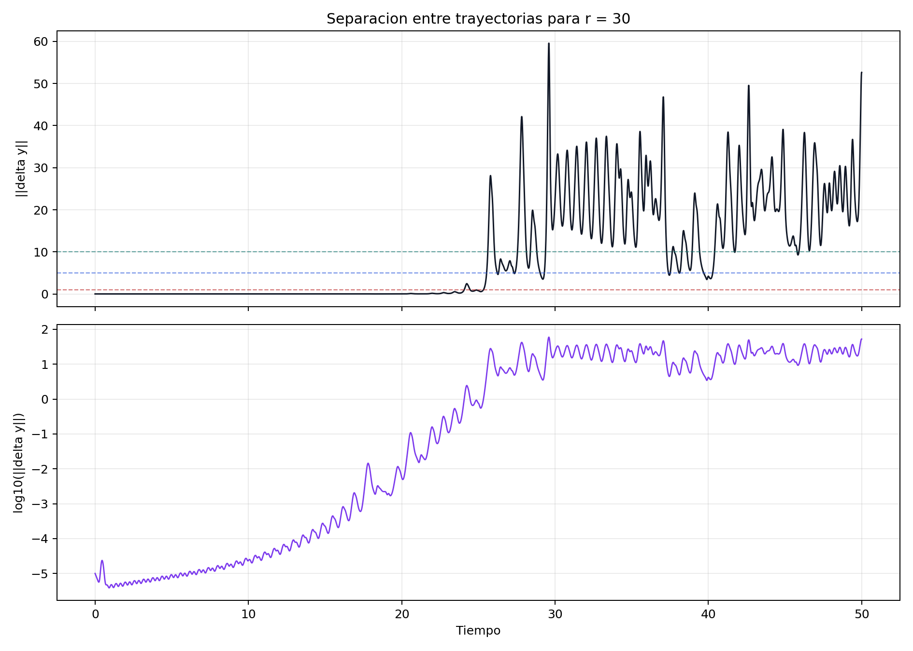

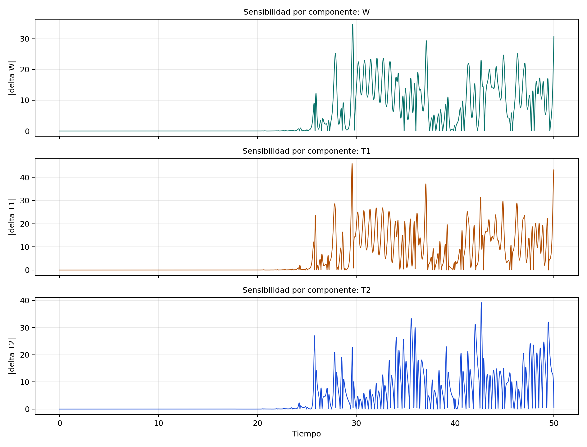

Los resultados cuantitativos muestran una perdida de sincronizacion muy clara:

- `||delta y(t)||` supera `1` cerca de `t = 24.08`;
- supera `5` cerca de `t = 25.54`;
- supera `10` cerca de `t = 25.62`.

Ademas, la pendiente ajustada de `log ||delta y(t)||` es aproximadamente `0.61` en la ventana `t in [10, 20]` y aumenta a alrededor de `0.88` en `t in [20, 24]`. Esto indica que la separacion no solo existe, sino que se acelera al aproximarse al momento en que ambas trayectorias dejan de parecer indistinguibles. La mayor discrepancia puntual aparece en `T1`, con `max |delta T1| ~ 45.91`, seguida por `T2` con `~ 39.21` y `W` con `~ 34.61`.

La lectura critica es directa: la geometria global del atractor se mantiene, pero la trayectoria puntual se vuelve rapidamente impredecible. Esta es justamente la manifestacion mas importante del caos determinista en esta tarea.

## Sensibilidad parametrica local

El parametro mas relevante del modelo es `r`, porque controla el cambio cualitativo del regimen dinamico. En comparacion, `Pr` y `b` se mantuvieron fijos para respetar el enunciado, pero en un analisis extendido tambien podrian perturbase.

Para esta tarea, un analisis local razonable consiste en perturbar `r` alrededor de valores criticos y medir como cambian:

- amplitud de `T1(t)` y `T2(t)`;
- maximos y minimos locales;
- varianza en el tramo final;
- numero de cambios de signo de `W` o `T1`;
- tiempo de permanencia aparente en cada lobo del atractor.

En ese contexto, el contraste entre `r = 24` y `r = 25` no es accidental: justamente explora una zona muy sensible del sistema. Lo importante no es solo que una grafica se vea mas irregular que otra, sino que un pequeño cambio en `r` cerca del umbral modifica la interpretacion dinamica del sistema. A `r = 24` una ventana corta todavia puede inducir una lectura casi estacionaria; a `r = 25`, esa lectura deja de ser sostenible y la dinamica no periodica se vuelve mas evidente.

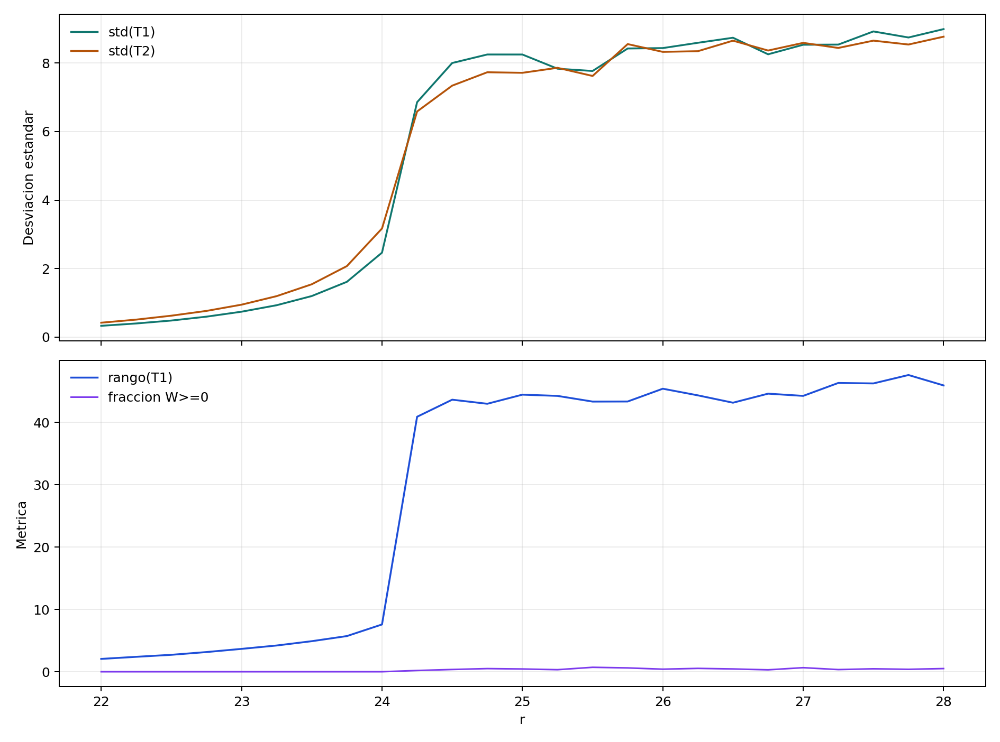

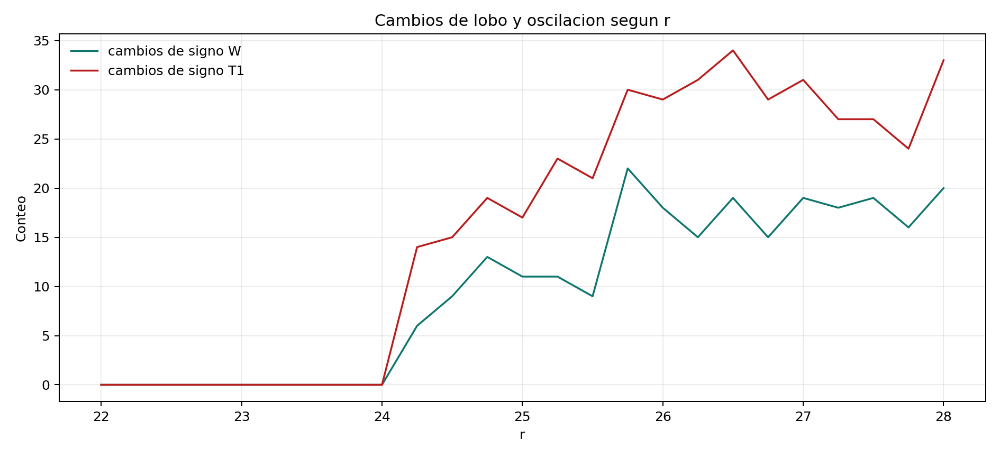

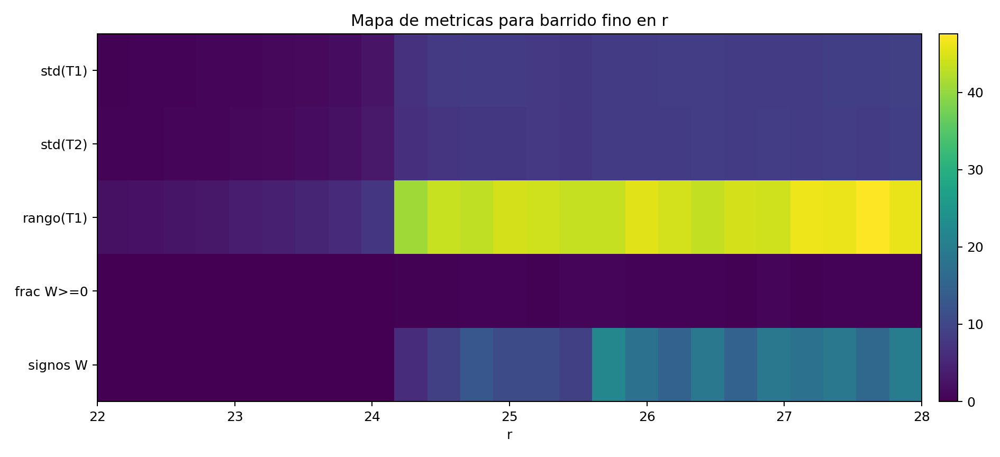

El barrido fino entre `r = 22` y `r = 28` confirma esta transicion de manera cuantitativa. Entre `r = 22` y `r = 24`, la desviacion estandar de `T1` crece desde aproximadamente `0.33` hasta `2.46`, mientras que el rango de `T1` aumenta desde `~2.06` hasta `~7.58`. En ese tramo, la fraccion de tiempo con `W >= 0` permanece practicamente en `0`, lo que indica una dinamica todavia atrapada en un solo lobo.

El cambio brusco aparece al pasar de `r = 24.0` a `r = 24.25`: `std(T1)` salta a `~6.86`, el rango de `T1` a `~40.90`, y los cambios de signo de `W` pasan de `0` a `6`. Ese salto confirma que la vecindad `24-25` es una zona extremadamente sensible del sistema. Para `r >= 24.75`, la ocupacion del espacio de fases se reparte entre ambos lobos y las metricas oscilan en un regimen de alta variabilidad.

## Barrido parametrico y lectura de bifurcacion

Mas alla de usar solo los casos `r = 2`, `10`, `24`, `25` y `30`, una extension natural es hacer un barrido fino en `r`, por ejemplo entre `0` y `40`, descartar el transitorio y graficar maximos locales de `T1` o `W` contra `r`. Ese procedimiento ayuda a distinguir con mayor claridad:

- intervalos donde el sistema converge a equilibrio;
- regiones donde aparecen oscilaciones persistentes;
- zonas donde emerge una dinamica caotica.

Desde el punto de vista conceptual, este analisis es una forma de conectar la experimentacion numerica con la idea de bifurcacion. Para el sistema clasico de Lorenz con `Pr = 10` y `b = 8/3`, el contraste entre `r = 24` y `r = 25` es especialmente instructivo porque se ubica cerca de la frontera donde los puntos fijos dejan de dar una descripcion suficientemente estable del comportamiento observado.

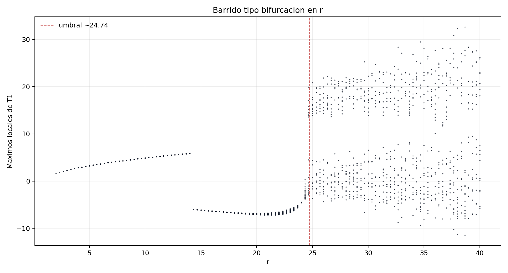

El diagrama tipo bifurcacion refuerza esa interpretacion. Para valores bajos de `r`, los maximos locales de `T1` se concentran en un conjunto muy reducido, coherente con convergencia a equilibrio. Al aumentar `r`, aparecen mas maximos y la nube de puntos se ensancha, lo que indica una respuesta cada vez menos compatible con un ciclo simple. La linea de referencia en `r ~ 24.74` ayuda a leer la zona donde el sistema deja de ser bien descrito por una dinamica casi estacionaria y entra en un regimen mucho mas irregular.

## Sensibilidad numerica al paso temporal

En sistemas caoticos, la sensibilidad no solo es fisica: tambien es numerica. Pequenas diferencias en `dt` alteran el error local y, al acumularse en el tiempo, pueden producir trayectorias distintas. Por eso, en este problema conviene evaluar la sensibilidad del resultado respecto al refinamiento temporal.

El estudio minimo recomendado es un refinamiento de malla con valores como:

- `dt = 0.02`
- `dt = 0.01`
- `dt = 0.005`
- `dt = 0.0025`

La comparacion no deberia juzgarse solo por coincidencia puntual a tiempos largos, porque en un sistema caotico esa exigencia es demasiado fuerte. Lo correcto es revisar:

- convergencia en ventanas cortas;
- estabilidad cualitativa del atractor;
- consistencia de estadisticos globales en ventanas largas.

Asi se separa el error numerico inevitable de la estructura robusta del sistema dinamico.

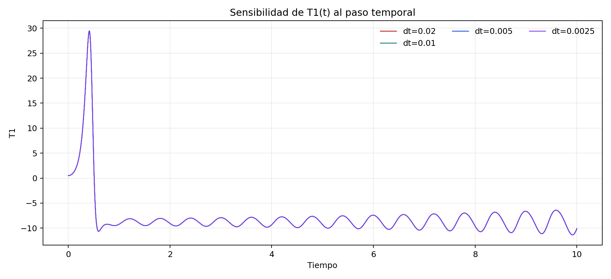

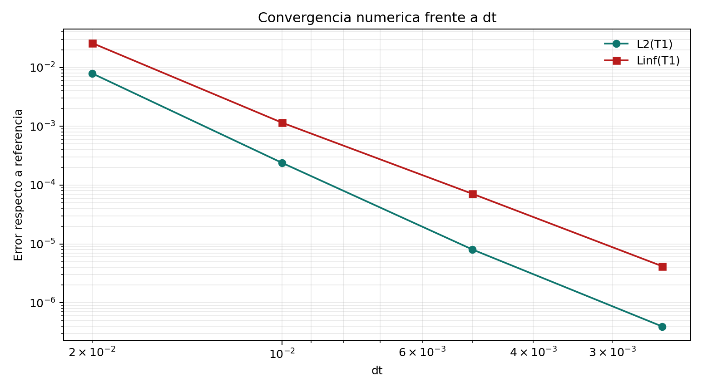

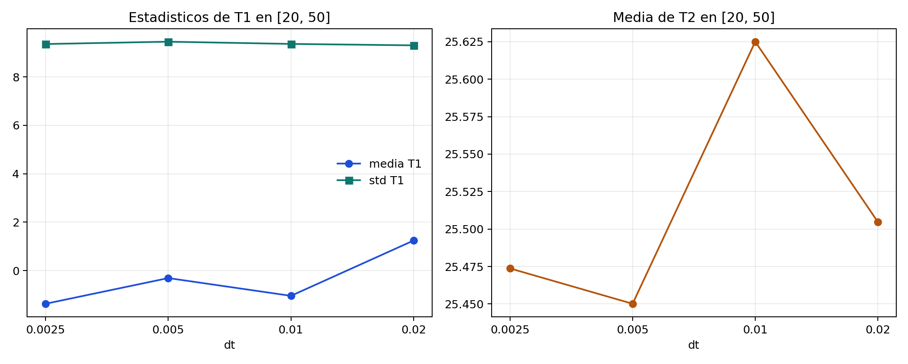

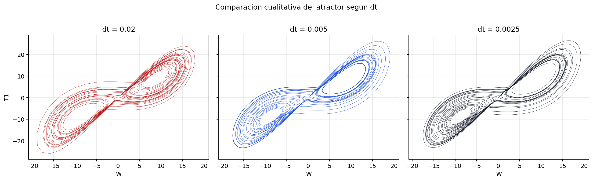

El refinamiento temporal muestra dos conclusiones complementarias. En la ventana corta `t <= 10`, la solucion converge de manera clara al reducir `dt`: el error `L2` en `T1` baja de `~7.92e-3` con `dt = 0.02` a `~3.94e-7` con `dt = 0.0025`, y el error `Linf` baja de `~2.60e-2` a `~4.17e-6`. Esto confirma que `RK4` responde de forma consistente al refinamiento de malla.

En ventanas largas, la lectura debe ser mas cuidadosa. Las medias finales de `T1` cambian entre `~1.24`, `-1.04`, `-0.31` y `-1.37` segun `dt`, mientras que la desviacion estandar permanece en el rango `9.30-9.46`. Esto muestra que la coincidencia punto a punto deja de ser robusta a largo plazo, pero la estructura estadistica del atractor sigue siendo comparable cuando `dt` es suficientemente pequeno. Esa es la razon por la que, en sistemas caoticos, los observables resumidos son mas informativos que una superposicion exacta de trayectorias largas.

## Sensibilidad al transitorio y al tiempo de integracion

Otro aspecto crucial es la sensibilidad al transitorio. En Lorenz, una solucion puede parecer casi constante durante un intervalo y luego desviarse hacia otro comportamiento. Por eso, al interpretar resultados, conviene comparar metricas calculadas en distintas ventanas, por ejemplo:

- `t in [0, 50]`
- `t in [10, 50]`
- `t in [20, 50]`

Esta comparacion ayuda a responder mejor una de las preguntas centrales del enunciado: si una solucion permanece realmente constante durante todo el periodo o si solo parecia estable en una fase inicial. Desde el punto de vista del analisis critico, esta distincion es muy importante para no confundir un transitorio largo con un equilibrio genuino.

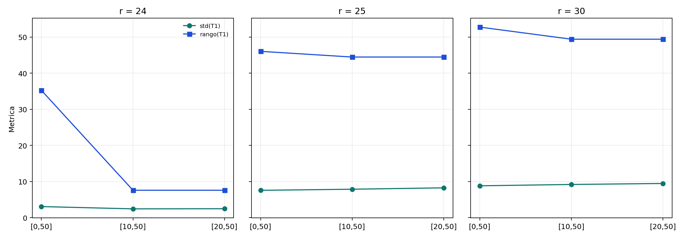

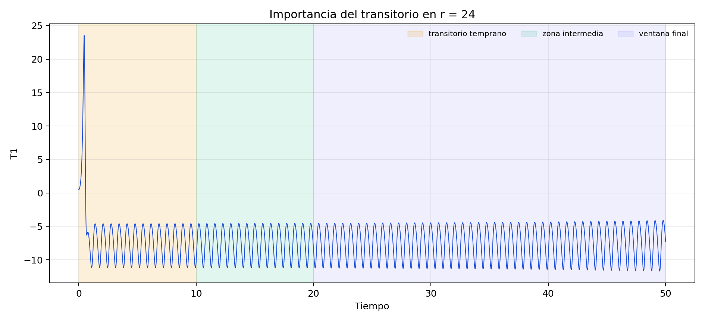

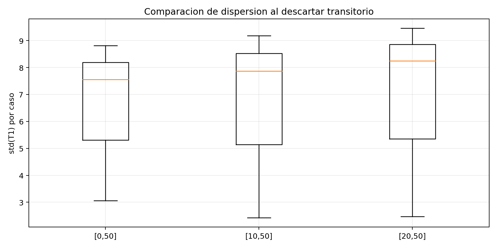

Los resultados muestran que el descarte del transitorio modifica de manera apreciable la lectura, sobre todo en `r = 25` y `r = 30`. Por ejemplo, para `r = 25`, la media de `T1` cambia desde `~ -3.34` en `[0, 50]` hasta `~ -0.86` en `[20, 50]`, y la fraccion de tiempo con `W >= 0` sube desde `~0.28` hasta `~0.44`. Para `r = 30`, la misma fraccion pasa de `~0.32` a `~0.49`, lo que indica una ocupacion mucho mas equilibrada entre lobos cuando se elimina el arranque.

En cambio, `r = 24` sigue mostrando una dinamica fuertemente sesgada hacia un solo lobo incluso al descartar el transitorio: la fraccion con `W >= 0` permanece en `0` para las ventanas `[10, 50]` y `[20, 50]`. Esta diferencia explica por que una inspeccion rapida puede llevar a pensar que `r = 24` es casi estacionario, cuando en realidad su comportamiento depende de la ventana desde la cual se mida la variabilidad.

## Trayectorias instantaneas y observables resumidos

En sistemas caoticos, exigir que dos trayectorias coincidan punto a punto en tiempos largos no siempre es el criterio mas informativo. A menudo es mas robusto comparar observables resumidos del atractor, por ejemplo:

- media y desviacion estandar de `W`, `T1` y `T2`;
- amplitud de oscilacion;
- extremos maximos y minimos;
- tiempo de permanencia por lobo;
- densidad de ocupacion en el espacio de fases.

La ventaja de este enfoque es que permite distinguir entre dos fenomenos diferentes:

- **divergencia de trayectorias**: la solucion puntual se separa rapidamente;
- **persistencia de estructura estadistica**: el sistema sigue ocupando el mismo atractor y conserva regularidades globales.

Esa diferencia es central para interpretar correctamente el caos determinista en esta tarea.

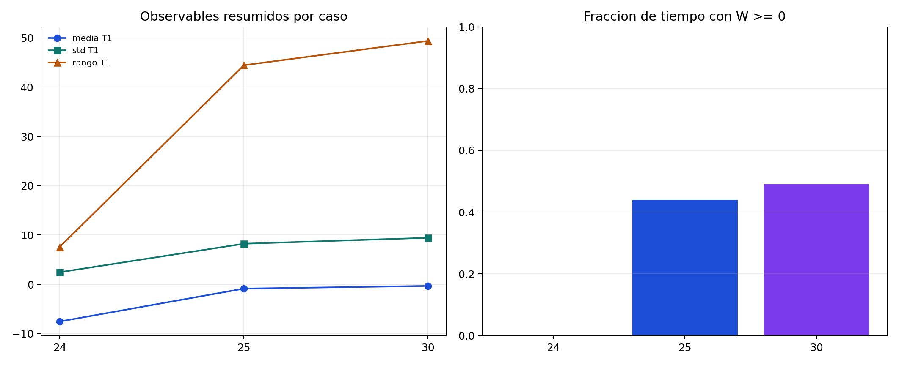

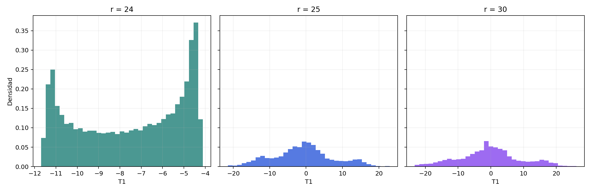

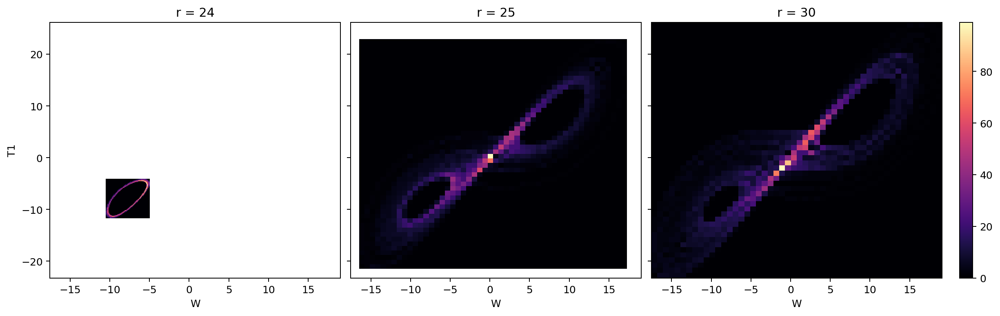

Las figuras de observables resumidos refuerzan esa idea. Para `r = 24`, la media final de `T1` en `[20, 50]` es aproximadamente `-7.53`, con `std(T1) ~ 2.46` y fraccion de ocupacion positiva de `0.0`, lo que muestra una dinamica aun muy sesgada. Para `r = 25`, la media sube a `~ -0.86`, `std(T1)` a `~8.25` y la ocupacion positiva a `~0.44`; para `r = 30`, la media es `~ -0.31`, `std(T1) ~ 9.46` y la ocupacion positiva `~0.49`.

En otras palabras, la trayectoria puntual diverge, pero la estructura estadistica tambien cambia de forma interpretable con `r`. Los histogramas y los mapas de densidad permiten ver que el atractor no solo es una curva extraña en el espacio de fases, sino una distribucion de ocupacion con propiedades cuantificables.

## Sintesis

El analisis de sensibilidad del sistema de Lorenz debe interpretarse en dos niveles complementarios:

- **Dinamico**: las condiciones iniciales y el valor de `r` controlan la transicion entre equilibrio, variabilidad persistente y caos.
- **Numerico**: `dt`, el tiempo de integracion y la seleccion de la ventana de analisis condicionan la interpretacion de la solucion computada.

Una sintesis compacta de los ejes principales es la siguiente:

| Analisis | Variable perturbada | Metrica principal | Lectura esperada |
| --- | --- | --- | --- |
| Sensibilidad a C.I. | `y_0` | `||delta y(t)||`, tiempo de divergencia | cuantifica perdida de predictibilidad puntual |
| Sensibilidad parametrica local | `r` | amplitud, varianza, cambios de lobo | identifica cambios de regimen cerca del umbral |
| Sensibilidad numerica | `dt` | convergencia de trayectorias cortas y estadisticos largos | evalua robustez computacional |
| Sensibilidad al transitorio | ventana temporal | metricas con y sin descarte inicial | evita confundir transitorios con equilibrio |
| Observables resumidos | estadisticos del atractor | media, desviacion, extremos, permanencia | separa trayectoria puntual y estructura global |

Desde el punto de vista de esta tarea, la conclusion mas robusta es que las distintas dimensiones del analisis se refuerzan mutuamente: las condiciones iniciales limitan la predictibilidad, el parametro `r` controla el cambio de regimen, `dt` condiciona la fidelidad numerica y la ventana temporal altera la lectura del comportamiento observado. En conjunto, estas evidencias muestran que el analisis critico del sistema de Lorenz no puede reducirse a una sola grafica, sino que requiere comparar trayectorias, estadisticos y escalas temporales de forma integrada.

## Vinculo con el capitulo
Esta seccion complementa la interpretacion desarrollada en la resolucion del inciso:

- [Resolucion Inciso 1: Sistema de Lorenz con RK4](resultados-discusion-lorenz-rk4.md)
- [Notebook asociado: Sistema de Lorenz con RK4](../notebooks/Guia_practica_Lorenz_RK4.ipynb)
- [Notebook de sensibilidad: Sistema de Lorenz con RK4](../notebooks/Guia_practica_Lorenz_Sensibilidad.ipynb)

## Referencias
- Campolongo, F., Cariboni, J., y Saltelli, A. (2007). *An effective screening design for sensitivity analysis*. *Environmental Modelling & Software, 22*(10), 1509-1518. https://doi.org/10.1016/j.envsoft.2006.10.004
- Lorenz, E. N. (1963). *Deterministic nonperiodic flow*. *Journal of the Atmospheric Sciences, 20*, 130-141. https://doi.org/10.1175/1520-0469(1963)020%3C0130:DNF%3E2.0.CO;2
- Politi, A. (2013). *Lyapunov exponent*. *Scholarpedia, 8*(3), 2722. https://doi.org/10.4249/scholarpedia.2722
- Shen, B.-W., Pielke Sr., R. A., y Zeng, X. (2022). *One saddle point and two types of sensitivities within the Lorenz 1963 and 1969 models*. *Atmosphere, 13*(5), 753. https://doi.org/10.3390/atmos13050753
- Soderlind, G., y Wang, L. (2006). *Adaptive time-stepping and computational stability*. *Journal of Computational and Applied Mathematics, 185*(2), 225-243. https://doi.org/10.1016/j.cam.2005.03.008
- SysIdentPy. (s. f.). *Lorenz system*. Documentacion tecnica. https://sysidentpy.org/es/user-guide/tutorials/chaotic-systems/lorenz-system/
- U.S. Environmental Protection Agency. (s. f.). *Sensitivity and uncertainty analyses: Training module*. https://archive.epa.gov/epa/measurements-modeling/sensitivity-and-uncertainty-analyses-training-module.html
- Wontchui, T. T., Ujjwal, S. R., Petmegni, D. S. M., Punetha, N., Sone, M. E., Effa, J. Y., y Ramaswamy, R. (2025). *Multistability in chaotic coupled Lorenz systems near the Hopf bifurcation boundary: Emergence of new stable equilibria*. *Chaos, Solitons & Fractals, 198*, 116507. https://doi.org/10.1016/j.chaos.2025.116507
- Zhang, X.-Y., Trame, M. N., Lesko, L. J., y Schmidt, S. (2015). *Sobol sensitivity analysis: A tool to guide the development and evaluation of systems pharmacology models*. *CPT: Pharmacometrics & Systems Pharmacology, 4*(2), 69-79. https://doi.org/10.1002/psp4.6
