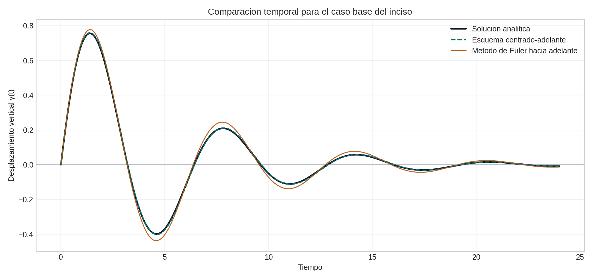
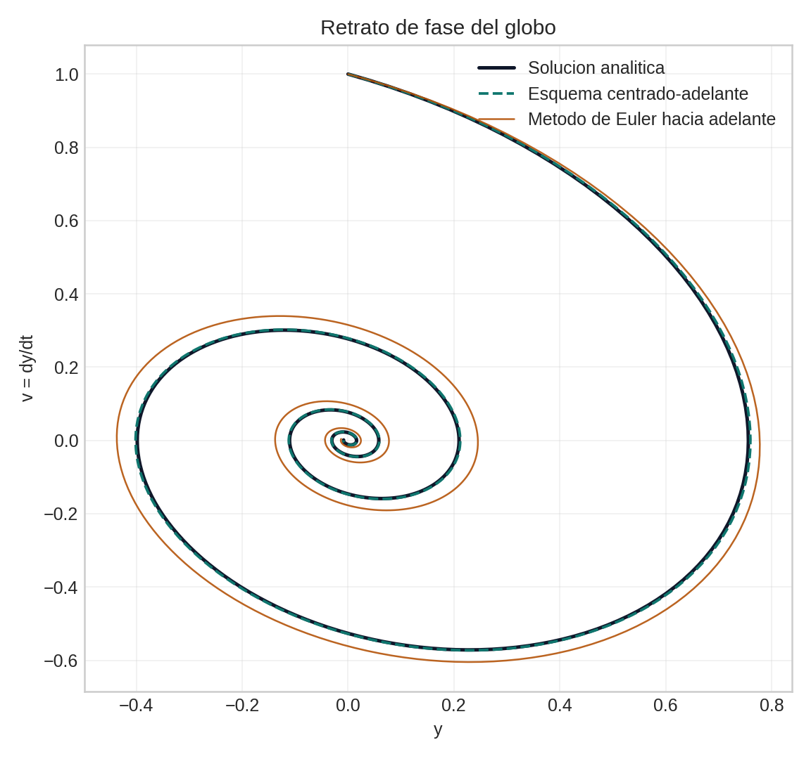
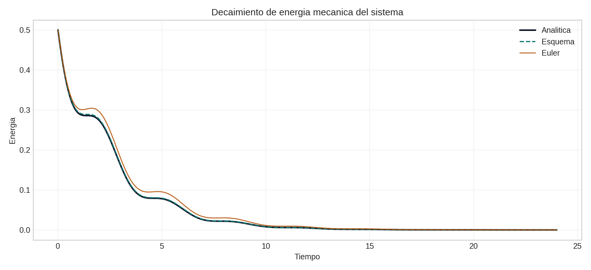
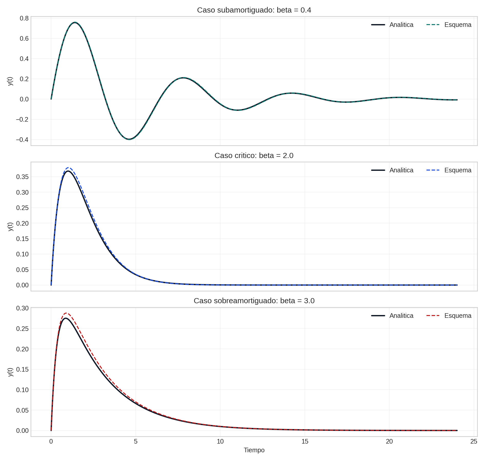
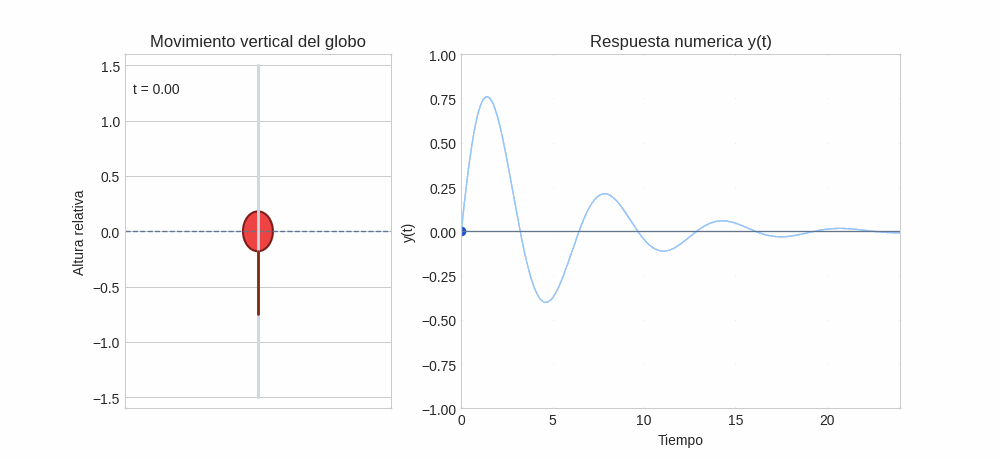

# Resolucion Inciso 1: Globo de medicion de variables meteorologicas

## Modelo continuo
El movimiento vertical del globo cerca de su nivel de equilibrio se representa mediante la ecuacion:

$$
m\,\ddot y = -\beta\,\dot y - \gamma\,y,
$$

o, de forma equivalente,

$$
m\,\ddot y + \beta\,\dot y + \gamma\,y = 0.
$$

donde `m` es la masa, `\beta` el coeficiente de amortiguamiento por resistencia del aire, `\gamma` la constante lineal de boyancia y `y(t)` el desplazamiento vertical respecto al nivel de equilibrio. El enunciado fija `y = 0` como posicion de equilibrio. Las condiciones iniciales son:

$$
y(0) = 0, \qquad \dot y(0) = v_0.
$$

## Derivacion del esquema de diferencias
Se discretiza el tiempo con un paso uniforme `h = Delta t` y se aproxima la segunda derivada con diferencias centrales:

$$
\ddot y(t_n) \approx \frac{y_{n+1} - 2y_n + y_{n-1}}{h^2},
$$

mientras que la primera derivada se aproxima con diferencia hacia adelante:

$$
\dot y(t_n) \approx \frac{y_{n+1} - y_n}{h}.
$$

Al sustituir ambas expresiones en la ecuacion diferencial, se obtiene:

$$
m\frac{y_{n+1} - 2y_n + y_{n-1}}{h^2} + \beta\frac{y_{n+1} - y_n}{h} + \gamma y_n = 0.
$$

Multiplicando por `h^2` y reordenando terminos:

$$
(m + \beta h) y_{n+1} = (2m + \beta h - \gamma h^2) y_n - m y_{n-1}.
$$

Por tanto, el esquema explicito para avanzar la solucion es:

$$
y_{n+1} = \frac{2m + \beta h - \gamma h^2}{m + \beta h} y_n - \frac{m}{m + \beta h} y_{n-1}.
$$

Este resultado muestra que el metodo depende de dos estados previos, `y_n` y `y_(n-1)`, por lo que se trata de un esquema de dos pasos.

## Diferencia con Euler hacia adelante
La diferencia entre este esquema y el metodo de Euler hacia adelante no es solo algebraica, sino tambien estructural.

- Euler hacia adelante es un metodo de un paso: para avanzar solo necesita el valor actual de la solucion y la pendiente evaluada en ese mismo instante.
- En una ecuacion de segundo orden, Euler suele aplicarse despues de reescribir el problema como un sistema de primer orden para `y` y `v = dy/dt`.
- El esquema derivado aqui no necesita introducir explicitamente una variable de velocidad en cada paso, pero si exige disponer de dos posiciones consecutivas.
- Por esa razon, las condiciones iniciales no bastan por si solas para iterar directamente la formula. Ademas de `y_0`, hace falta construir un valor inicial adicional `y_1`.

Desde el punto de vista numerico, este detalle cambia la implementacion: el metodo de Euler hacia adelante arranca de forma inmediata con `(y_0, v_0)`, mientras que el esquema de diferencias requiere una etapa de arranque antes de usar la recurrencia principal.

## Inicio de la integracion numerica
La integracion se inicia con `y_0 = y(0) = 0` y con una aproximacion para `y_1`. La opcion mas simple consiste en usar Euler hacia adelante sobre la posicion:

$$
y_1 = y_0 + v_0 h = v_0 h.
$$

Sin embargo, una aproximacion mas consistente con la dinamica del problema usa Taylor de segundo orden:

$$
y_1 = y_0 + v_0 h + \frac{1}{2} a_0 h^2,
$$

donde la aceleracion inicial se obtiene de la ecuacion original:

$$
a_0 = \ddot y(0) = -\frac{\beta v_0 + \gamma y_0}{m} = -\frac{\beta v_0}{m}.
$$

Como `y_0 = 0`, el arranque por Taylor queda:

$$
y_1 = v_0 h - \frac{\beta v_0}{2m} h^2.
$$

Con `y_0` y `y_1` ya disponibles, la solucion se genera de manera recursiva para `n = 1, 2, 3, ...` usando el esquema derivado.

## Analisis critico de la discretizacion
El interes principal de este ejercicio no es solo obtener una trayectoria numerica, sino evaluar si la discretizacion representa correctamente la fisica del sistema.

## Validacion con el notebook
El notebook asociado resuelve el caso base del inciso usando la ecuacion del enunciado, con la eleccion de referencia `m = 1`, `\gamma = 1`, `\beta = 0.4`, `y(0) = 0`, `v_0 = 1`, `h = 0.04` y `t_final = 24`. Esta configuracion hace que el globo parta exactamente desde el equilibrio y que la velocidad inicial induzca la oscilacion amortiguada.

En la comparacion temporal siguiente se observa la respuesta analitica, la solucion obtenida con el esquema derivado y la obtenida con Euler hacia adelante:

Para este caso base, el error cuadratico medio del esquema derivado fue aproximadamente `0.00366`, mientras que el metodo de Euler hacia adelante produjo `0.01773`. Esto muestra que, para el paso temporal usado en el inciso, la discretizacion con diferencias centrales para `y''` y hacia adelante para `y'` sigue mejor la amplitud y el desfase de la solucion analitica.

El retrato de fase tambien confirma que la trayectoria numerica del esquema derivado permanece mas cercana a la espiral amortiguada esperada:

### Precision esperada
La aproximacion de la segunda derivada es de orden `O(h^2)`, mientras que la derivada primera se aproxima con una formula hacia adelante de orden `O(h)`. En consecuencia, el esquema completo no hereda automaticamente un orden alto en todos sus terminos, y la eleccion de `h` sigue siendo decisiva para controlar el error.

### Papel del paso temporal
Si `h` es demasiado grande, la solucion puede distorsionar la frecuencia de oscilacion, exagerar o atenuar artificialmente el amortiguamiento e incluso producir inestabilidades numericas. Si `h` es suficientemente pequeno, el metodo captura mejor la oscilacion amortiguada y el decaimiento progresivo de la amplitud.

El barrido de pasos temporales del notebook respalda esta idea:

En el caso subamortiguado base, al reducir `h` desde `0.4` hasta `0.025`, el error del esquema baja aproximadamente de `0.03315` a `0.00230`, mientras que el metodo de Euler hacia adelante baja de `0.61011` a `0.01076`. El patron general es claro: ambos metodos mejoran al refinar la malla temporal, pero el esquema derivado conserva ventaja en el caso principal del ejercicio.

### Interpretacion fisica
Cuando `\beta > 0`, la amplitud debe disminuir con el tiempo porque el sistema pierde energia por resistencia del aire. Una solucion numerica razonable debe reproducir ese decaimiento sin introducir crecimiento espurio. Asimismo, la rapidez de la oscilacion debe estar ligada a la escala `sqrt(\gamma/m)`, de modo que cambios en `\gamma` o `m` modifiquen la frecuencia observada de manera fisicamente coherente.

El notebook verifica este comportamiento con la evolucion de la energia mecanica discreta:

Aunque la energia no se conserva por la presencia de amortiguamiento, la tendencia debe ser decreciente. Esa disminucion aparece tanto en la solucion analitica como en las aproximaciones numericas, lo que refuerza la interpretacion fisica correcta del metodo.

### Comparacion conceptual con Euler
Para un mismo `h`, este esquema suele representar mejor la curvatura temporal de la posicion que un Euler directo sobre el sistema equivalente de primer orden. Sin embargo, esa ventaja potencial exige un arranque bien construido y una revision critica de la estabilidad. En otras palabras, un metodo aparentemente mas sofisticado no garantiza por si solo mejores resultados si se usa con un paso inadecuado o con una inicializacion pobre.

El notebook tambien explora los regimens subamortiguado, critico y sobreamortiguado manteniendo `y(0)=0` y `v_0 = 1`:

Esta comparacion deja una leccion importante para el analisis critico: el esquema derivado no debe defenderse con afirmaciones absolutas del tipo "siempre es mejor que el metodo de Euler hacia adelante". En el caso base subamortiguado del inciso si ofrece una mejora clara, pero en otros regimens la diferencia puede cambiar y debe juzgarse con metricas, estabilidad y coherencia fisica, no solo por intuicion.

## Visualizacion del movimiento
La animacion generada en el notebook muestra directamente el globo partiendo desde `y = 0`, cruzando el nivel de equilibrio y perdiendo amplitud con el tiempo:

Esta visualizacion responde de forma directa a la parte exploratoria del inciso `c`, porque permite relacionar la formula de diferencias con el comportamiento fisico esperado del sistema.

## Continuacion del estudio
El desarrollo de esta resolucion se complementa con una pagina especifica de sensibilidad, donde se separa el efecto de los parametros fisicos del efecto de la discretizacion numerica:

- [Analisis de sensibilidad](analisis-sensibilidad-globo-medicion)

## Conclusiones

1. El esquema de diferencias finitas derivado para el globo es explicito y de dos pasos, porque calcula `y_(n+1)` a partir de `y_n` y `y_(n-1)`.
2. La diferencia principal frente a Euler hacia adelante esta en la forma de iniciar la integracion: aqui no basta con `y_0 = 0` y `v_0`, sino que se debe estimar tambien `y_1`.
3. En este inciso el arranque queda especialmente claro porque `y_0 = 0`, de modo que `a_0 = -(\beta v_0)/m` y el primer paso puede escribirse de forma cerrada.
4. En el caso base del ejercicio, la validacion numerica muestra que el esquema derivado reproduce mejor la solucion analitica que el metodo de Euler hacia adelante para el mismo `h`.
5. La calidad de la solucion depende de manera fuerte del paso temporal `h`, tanto por precision como por estabilidad.
6. El analisis critico debe verificar si la amplitud decrece de forma fisicamente razonable, si la frecuencia numerica concuerda con la dinamica esperada y si las conclusiones se mantienen al cambiar de regimen dinamico.

## Referencias base
- Ortega, R. (2014). *Diferenciacion numerica: aplicaciones computacionales*. Universidad de Santiago de Chile. https://mecanica-usach.mine.nu/media/uploads/L06_DiferenciacionNumerica.pdf
- Cordero, P., y Soto, R. (2011). *Ecuaciones diferenciales ordinarias: integracion numerica*. Universidad de A Coruna. http://caminos.udc.es/info/asignaturas/grado_itop/221/images/Imagenes_complementarios/Edos_teoria.pdf
