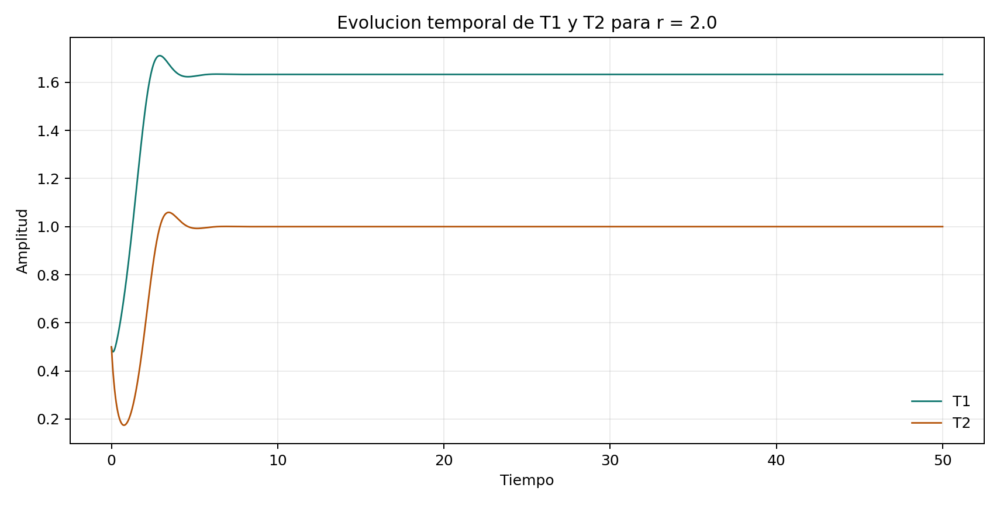
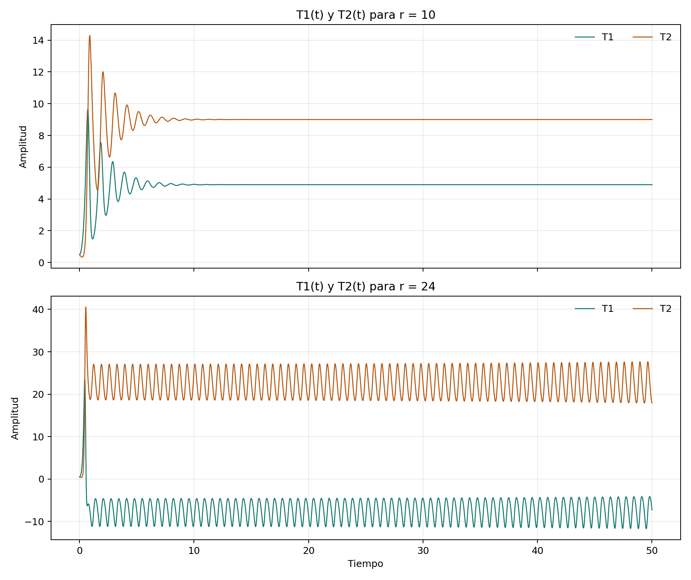
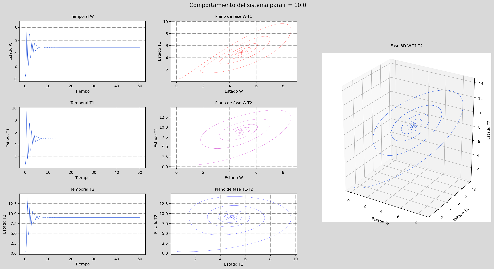
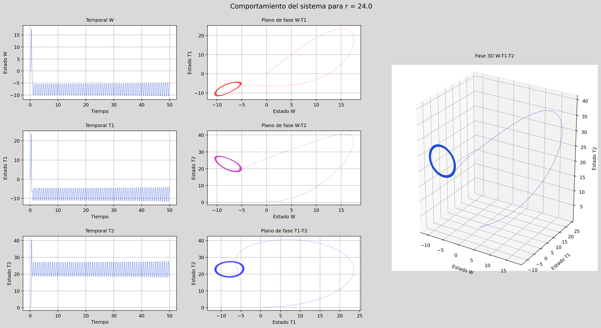
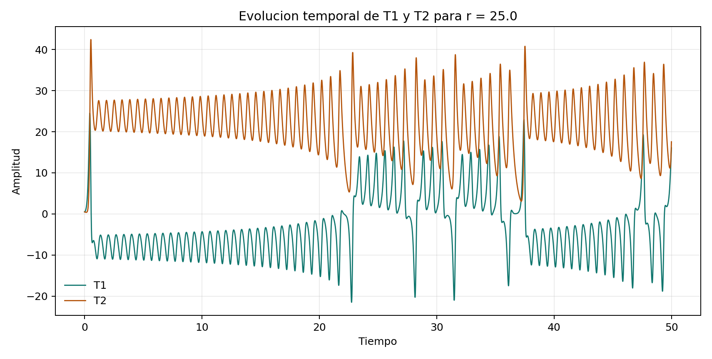
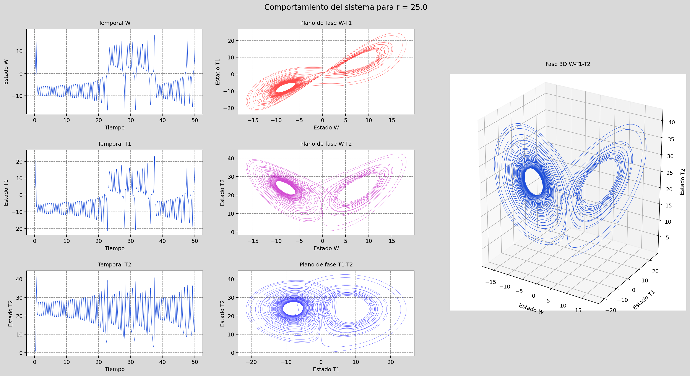
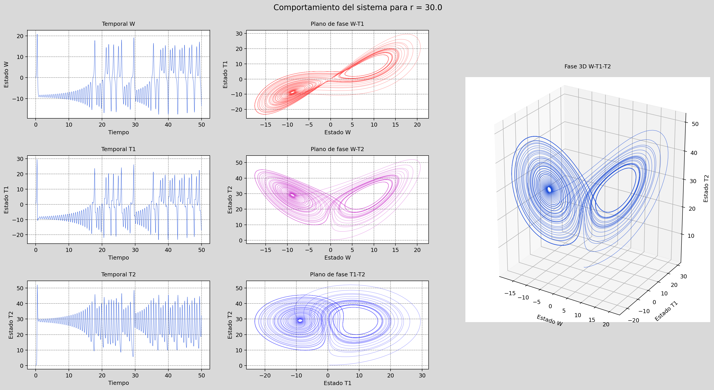
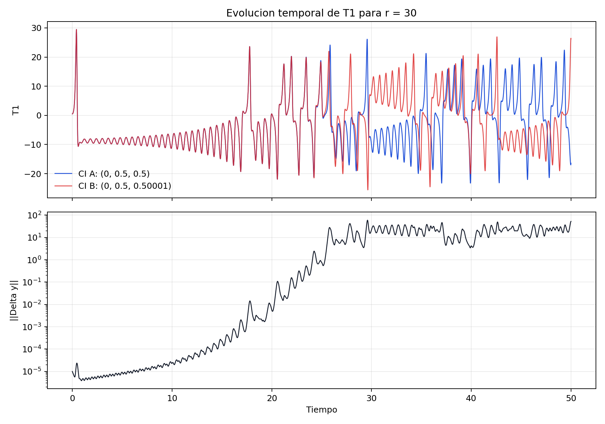
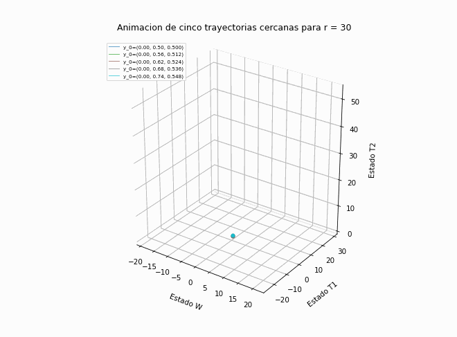

# Resolucion Inciso 1: Sistema de Lorenz con RK4

La resolucion se organiza siguiendo el enunciado original y prioriza la interpretacion critica de los resultados. En este problema, la implementacion de `RK4` es el medio para estudiar la dinamica del sistema; el resultado central es entender como cambia la evolucion de `W`, `T1` y `T2` cuando `r` atraviesa distintos regimens dinamicos.

:::{dropdown} Implementacion numerica
La integracion se realizo con un esquema `RK4` clasico para el sistema del enunciado:

`dW/dt = Pr (T1 - W)`

`dT1/dt = -W T2 + r W - T1`

`dT2/dt = W T1 - b T2`

con `Pr = 10`, `b = 8/3`, `dt = 0.005`, `0 <= t <= 50` y condicion inicial base `y_0 = (0, 0.5, 0.5)`.

En cada paso se calcularon `k1`, `k2`, `k3` y `k4`, y luego se actualizo el estado con:

`y_(n+1) = y_n + (dt/6) (k1 + 2 k2 + 2 k3 + k4)`

La implementacion final se hizo en Python para dejar un flujo reproducible dentro del notebook, pero sigue exactamente la misma logica de las rutinas `dydt.m`, `lorenz.m` y `rkstep.m` entregadas como apoyo. La unica traduccion realizada fue de MATLAB a Python, manteniendo la misma dinamica y la misma notacion `W`, `T1`, `T2` del inciso.
:::

## Caso `r = 2`

Para este caso se graficaron `T1(t)` y `T2(t)`, tal como pide el inciso `c`. Ambas variables muestran un transitorio amortiguado y luego convergen a valores casi constantes. Numericamente, el estado final es cercano a `(W, T1, T2) = (1.633, 1.633, 1.000)`, consistente con el equilibrio analitico no trivial `(+/-sqrt(b(r-1)), +/-sqrt(b(r-1)), r-1)` para `r > 1`.

El punto importante no es solo que las curvas se vean suaves, sino que ambas variables pierden variabilidad de manera sostenida. Esa caida de amplitud es la evidencia de que el sistema entra en un equilibrio estable. Fisicamente, esto representa un regimen de conveccion estable, donde la circulacion organizada no se desestabiliza y las perturbaciones iniciales se disipan.

## Casos `r = 10` y `r = 24`

En `d` el enunciado pide dos salidas: la evolucion temporal de `T1` y `T2`, y la trayectoria en el espacio de fases `W, T1, T2`. Ambas quedaron incluidas arriba. Para `r = 10`, la trayectoria converge a un punto fijo. El sistema entra en una espiral amortiguada en el espacio de fases y termina cerca de `(4.899, 4.899, 9.000)`. Las desviaciones estandar finales de `T1` y `T2` son practicamente cero.

Para `r = 24`, en cambio, la solucion ya no se fija en un unico equilibrio. Las series `T1(t)` y `T2(t)` siguen oscilando con amplitud importante en el tramo final, y la trayectoria en el espacio de fases recorre regiones amplias alrededor de los dos lobulos del atractor. En esta simulacion, la desviacion estandar de `T1(t)` en los ultimos diez unidades de tiempo fue aproximadamente `2.56`, mientras que para `T2(t)` fue `3.32`, confirmando que el sistema sigue activo y no se estaciona.

La comparacion entre `r = 10` y `r = 24` es una de las mas importantes del ejercicio. Los collages, ahora organizados como en el esquema MATLAB del autor, permiten leer simultaneamente las tres series temporales, las tres proyecciones bidimensionales y la trayectoria tridimensional completa. En `r = 10` todavia domina la atraccion hacia un equilibrio estable; en `r = 24` ya no basta mirar un tramo corto de las curvas para concluir que el sistema se estabiliza. La lectura critica correcta es que `r = 24` se ubica en un regimen transicional: puede mostrar episodios temporalmente ordenados, pero globalmente mantiene variabilidad persistente y cambios entre regiones del espacio de fases.

## Caso `r = 25`

Al pasar de `r = 24` a `r = 25`, la dinamica se vuelve mas irregular. Las series temporales de `T1(t)` y `T2(t)` mantienen oscilaciones de mayor amplitud y el collage temporal-fases llena con mas claridad la geometria de doble lobulo asociada al atractor de Lorenz. Las proyecciones `W-T1`, `W-T2` y `T1-T2` muestran que la irregularidad no es un detalle de una sola vista, sino una propiedad consistente de la trayectoria.

La comparacion con `r = 24` muestra que la solucion anterior no debe asumirse constante durante todo el periodo de integracion. Aunque en algunos intervalos `r = 24` puede parecer casi periodica o concentrada cerca de un lobo, el sistema sigue siendo sensible a perturbaciones y permanece fuera de equilibrio. En `r = 25`, esa conclusion se vuelve todavia mas clara: la estructura atractora domina la evolucion y la interpretacion correcta ya no es la de una aproximacion a un equilibrio, sino la de un movimiento persistentemente no periodico dentro de un conjunto acotado.

## Caso `r = 30` y sensibilidad a condiciones iniciales

En `f` el inciso pide mostrar como evoluciona `T1` en el tiempo para dos condiciones iniciales diferentes. Se usaron exactamente las dos condiciones de la guia: `y_0 = (0, 0.5, 0.5)` y `y_0 = (0, 0.5, 0.50001)`. La figura temporal muestra `T1(t)` para ambas trayectorias y, adicionalmente, se reemplazo la comparacion estatica en el espacio de fases por una animacion para mostrar de manera mas clara como ambas soluciones recorren el atractor.

En el espacio de fases, el caso `r = 30` muestra con claridad la geometria de doble lobulo del atractor de Lorenz. El collage, ahora fiel a la distribucion del esquema MATLAB, permite verificar esta conclusion en varias proyecciones a la vez: en la izquierda se observa la evolucion temporal de `W`, `T1` y `T2`; en el centro, las tres proyecciones de fase bidimensional; y a la derecha, la trayectoria tridimensional completa. La primera animacion complementaria permite ir un paso mas alla: muestra que ambas soluciones permanecen dentro del mismo atractor, pero dejan de coincidir en el recorrido puntual a medida que transcurre el tiempo. Esa desincronizacion progresiva es mucho mas evidente en movimiento que en una imagen fija.

En la serie temporal, durante el transitorio inicial ambas curvas de `T1` son casi indistinguibles, pero despues se separan rapidamente. La norma de la diferencia entre estados supera `1` cerca de `t = 24.08` y supera `5` cerca de `t = 25.54`. Esta es la evidencia cuantitativa mas fuerte del caso: el sistema conserva una estructura global reconocible, pero pierde capacidad predictiva punto a punto cuando la condicion inicial cambia muy ligeramente. Fisicamente, esto explica por que un modelo atmosferico simplificado puede conservar un patron global de conveccion y, al mismo tiempo, perder predictibilidad en el detalle temporal.

La segunda animacion, ubicada al final de este bloque como cierre visual del caso `r = 30`, amplia la interpretacion anterior desde una sola pareja de trayectorias hacia un conjunto de cinco orbitas cercanas. Su valor analitico es mostrar que la sensibilidad a condiciones iniciales no depende de una eleccion accidental de dos estados iniciales, sino que es una propiedad estructural del regimen caotico para este valor de `r`. Todas las trayectorias permanecen confinadas dentro de la misma geometria global del atractor, pero se redistribuyen con rapidez entre regiones distintas del espacio de fases y no conservan una secuencia comun de evolucion.

Esta observacion permite una lectura mas profunda del problema. El caos no implica que el sistema abandone el atractor ni que pierda toda forma de organizacion; implica, mas bien, que la trayectoria instantanea deja de ser reproducible a largo plazo aun cuando la estructura geometrica general permanezca. En este sentido, la segunda animacion justifica por que en la pagina de analisis de sensibilidad se introducen observables resumidos, densidades de ocupacion y metricas estadisticas: cuando la trayectoria puntual deja de ser informativa por si sola, la interpretacion rigurosa debe desplazarse hacia propiedades globales del atractor.

## Discusion critica

El resultado central del ejercicio no es simplemente que aparezca una figura con forma de mariposa, sino que la transicion al caos puede leerse de manera escalonada en las distintas salidas. Las series temporales de `T1(t)` y `T2(t)` muestran si el sistema amortigua perturbaciones o si mantiene oscilaciones persistentes; el espacio de fases muestra si esas oscilaciones corresponden a una aproximacion a un punto fijo o a un movimiento recurrente dentro de una estructura atractora.

La comparacion entre `r = 24` y `r = 25` merece especial cuidado. En ambos casos el sistema ya no se comporta como en `r = 2` o `r = 10`, pero `r = 24` todavia puede inducir una lectura engañosa si se mira solo una parte corta de la integracion. `r = 25` ayuda a corregir esa interpretacion: deja mas claro que la variabilidad observada no es un transitorio largo hacia un equilibrio, sino la manifestacion de una dinamica no periodica sostenida.

La comparacion entre las dos condiciones iniciales de `r = 30` completa esa lectura. La geometria global del atractor se conserva, pero la trayectoria puntual se vuelve impredecible a largo plazo. Esa combinacion entre orden global y desincronizacion local es precisamente la razon por la que el sistema de Lorenz sigue siendo un ejemplo canonico de caos determinista.

## Sintesis comparativa

| Caso | Comportamiento dominante | Evidencia numerica | Interpretacion fisica |
| --- | --- | --- | --- |
| `r = 2` | Convergencia a equilibrio | `T1(t)` y `T2(t)` se estabilizan | Conveccion estable y perturbaciones amortiguadas |
| `r = 10` | Convergencia a equilibrio no trivial | Espiral amortiguada hacia un punto fijo | Regimen convectivo estable |
| `r = 24` | Regimen transicional muy variable | `std[T1] ~ 2.56`, `std[T2] ~ 3.32` | Cercania al umbral de caos |
| `r = 25` | Atractor no periodico mas claro | Oscilaciones persistentes y cambios de lobo | Regimen caotico emergente |
| `r = 30` | Caos con alta sensibilidad inicial | Divergencia visible en `T1(t)` hacia `t ~ 24-26` | Predictibilidad limitada |

## Conclusiones

1. El esquema `RK4` reproduce de forma estable la transicion desde puntos fijos hacia un atractor caotico al aumentar `r`.
2. Las ecuaciones implementadas corresponden al sistema del enunciado en variables `W`, `T1` y `T2`, con la condicion inicial correcta `y0 = (0, 0.5, 0.5)`.
3. Para `r = 2` y `r = 10`, la dinamica converge a equilibrios no triviales y la variabilidad final de `T1(t)` y `T2(t)` es practicamente nula.
4. Para `r = 24` y `r = 25`, la solucion deja de ser estacionaria y aparecen oscilaciones persistentes asociadas al atractor de Lorenz.
5. La solucion para `r = 24` no puede considerarse constante durante todo el intervalo porque el sistema sigue explorando distintas regiones del espacio de fases.
6. Para `r = 30`, una perturbacion inicial de solo `0.00001` en `T2(0)` basta para producir trayectorias claramente diferentes, mostrando sensibilidad a condiciones iniciales y perdida de predictibilidad de largo plazo.

## Continuacion del analisis
La interpretacion de estos resultados se complementa con una seccion especifica de analisis de sensibilidad, donde se separa la sensibilidad dinamica de la sensibilidad numerica y se proponen extensiones concretas del estudio:

- [Analisis de sensibilidad: Sistema de Lorenz con RK4](analisis-sensibilidad-lorenz-rk4.md)
