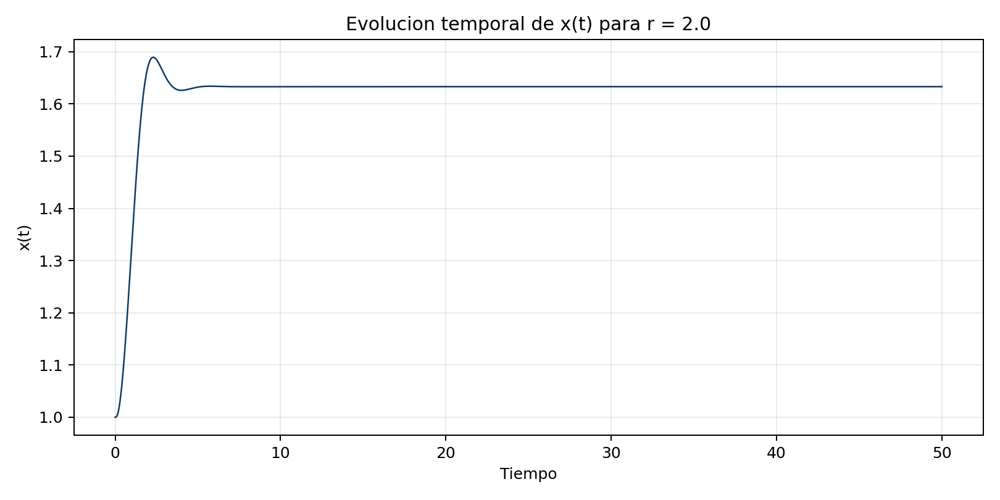
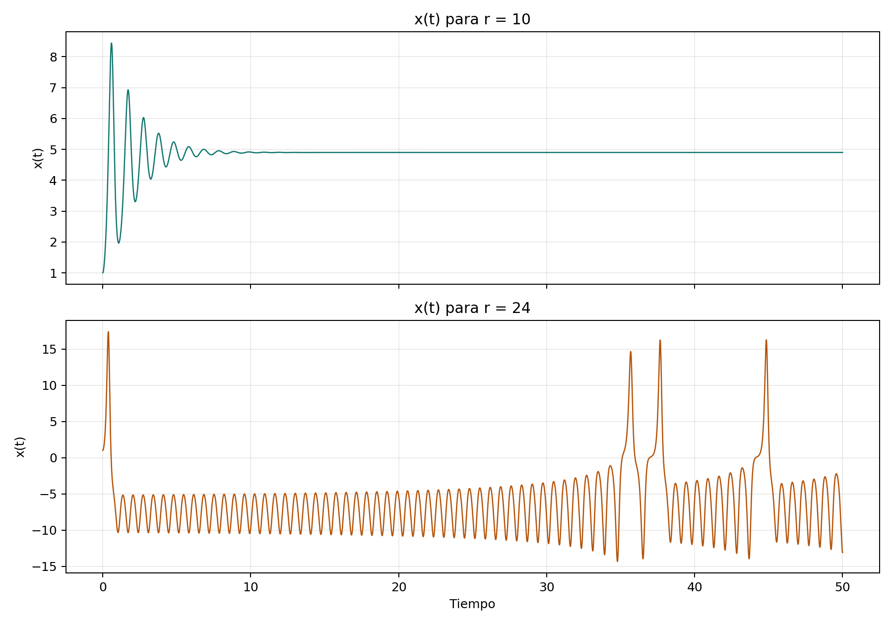
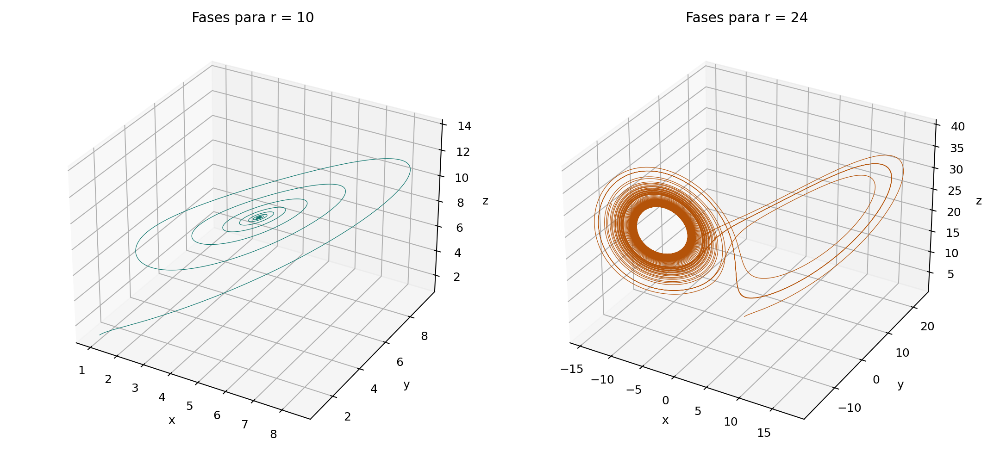
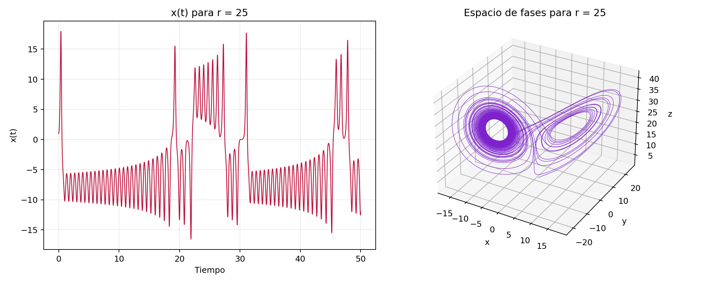
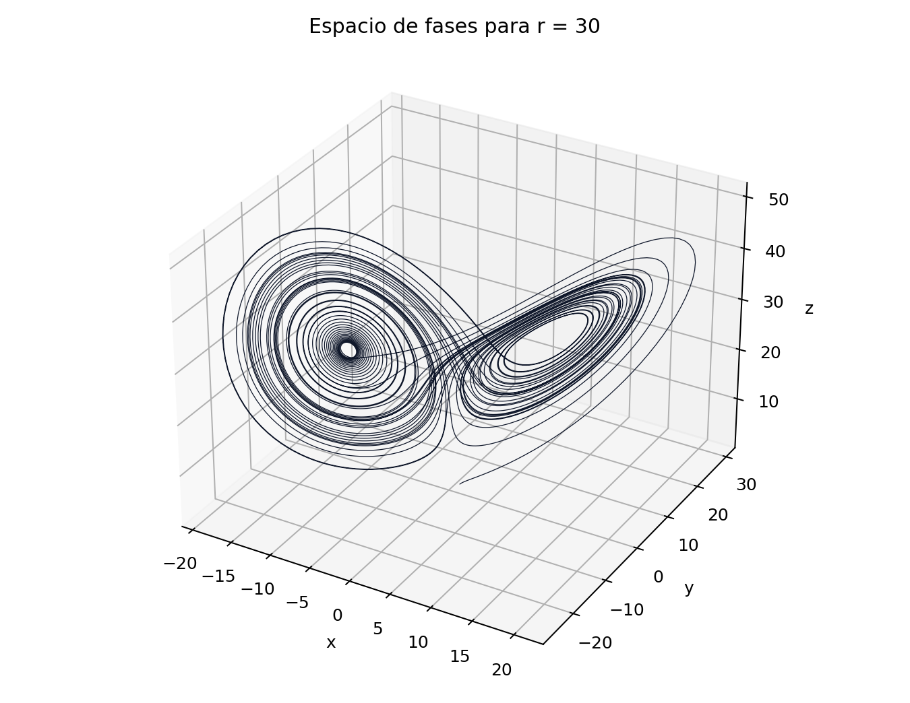
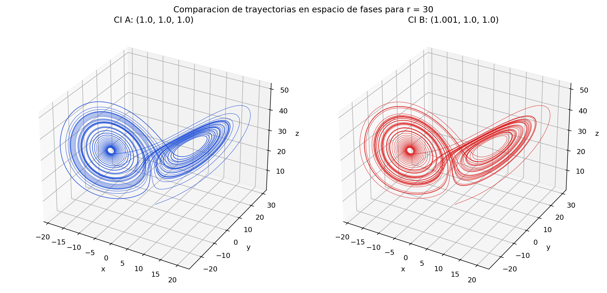
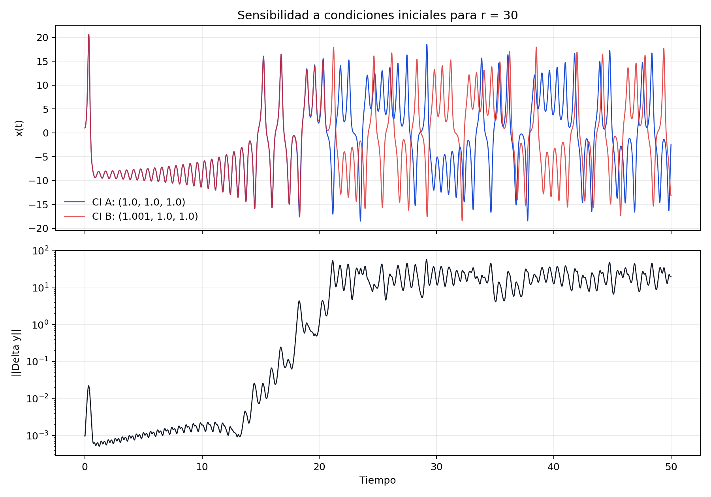

# Resolucion Inciso 1: Sistema de Lorenz con RK4

:::{dropdown} Implementacion numerica
La integracion se realizo con un esquema `RK4` clasico para el sistema:

`dx/dt = sigma (y - x)`

`dy/dt = x (r - z) - y`

`dz/dt = xy - b z`

con `sigma = 10`, `b = 8/3`, `dt = 0.005`, `tstop = 50` y condicion inicial `(1, 1, 1)`.

En cada paso se calcularon `k1`, `k2`, `k3` y `k4`, y luego se actualizo el estado con:

`y_(n+1) = y_n + (dt/6) (k1 + 2 k2 + 2 k3 + k4)`

La implementacion final se hizo en Python para dejar un flujo reproducible dentro del notebook, pero sigue la misma logica de las rutinas `dydt.m`, `lorenz.m` y `rkstep.m` entregadas como apoyo.
:::

## Caso `r = 2`

La solucion converge rapidamente a un punto fijo no trivial. Numericamente, el estado final es cercano a `(1.633, 1.633, 1.000)`, que coincide con el equilibrio analitico `(+/-sqrt(b(r-1)), +/-sqrt(b(r-1)), r-1)` para `r > 1`.

El comportamiento de `x(t)` es amortiguado: aparece un transitorio corto y luego la serie se vuelve practicamente constante. Fisicamente, esto representa un regimen de conveccion estable, donde la circulacion organizada no se desestabiliza y las perturbaciones iniciales se disipan.

## Casos `r = 10` y `r = 24`

Para `r = 10`, la trayectoria tambien converge a un punto fijo. El sistema entra en una espiral amortiguada en el espacio de fases y termina cerca de `(4.899, 4.899, 9.000)`. La desviacion estandar de `x(t)` en los ultimos diez unidades de tiempo es practicamente cero.

Para `r = 24`, en cambio, la solucion ya no se fija en un unico equilibrio. La serie `x(t)` sigue oscilando con amplitud importante en el tramo final, y la trayectoria en el espacio de fases recorre regiones amplias alrededor de los dos lobulos del atractor. En esta simulacion la desviacion estandar de `x(t)` en los ultimos diez unidades de tiempo fue aproximadamente `4.96`, lo que confirma que el sistema sigue activo y no se estaciona.

La diferencia principal es dinamica: `r = 10` sigue en un regimen estable y disipativo, mientras que `r = 24` se encuentra muy cerca del umbral de perdida de estabilidad de los puntos fijos. Fisicamente, esto puede interpretarse como un aumento de la intensidad de la conveccion que favorece cambios persistentes entre estados de circulacion opuestos.

## Caso `r = 25`

Al pasar de `r = 24` a `r = 25`, la dinamica se vuelve mas irregular. La serie temporal de `x(t)` mantiene oscilaciones de mayor amplitud y la trayectoria 3D llena con mas claridad la geometria de doble lobulo asociada al atractor de Lorenz.

La comparacion con `r = 24` muestra que la solucion anterior no debe asumirse constante para todo el periodo de integracion. Aunque en algunos intervalos `r = 24` puede parecer casi periodico o concentrado cerca de un lobo, el sistema sigue siendo sensible a perturbaciones y permanece fuera de equilibrio. Por eso, una ventana temporal corta puede sugerir regularidad, mientras que una integracion mas larga revela cambios de lobo y variabilidad persistente.

## Caso `r = 30` y sensibilidad a condiciones iniciales

En el espacio de fases, el caso `r = 30` muestra con claridad la geometria de doble lobulo del atractor de Lorenz. La trayectoria no converge a un punto fijo ni a una orbita periodica simple, sino que alterna de manera irregular entre dos regiones preferentes del espacio de estados. Esa estructura global se conserva aunque cambie la condicion inicial exacta.

Para `r = 30` se integraron dos trayectorias con condiciones iniciales cercanas: `(1.0, 1.0, 1.0)` y `(1.001, 1.0, 1.0)`. La comparacion en el espacio de fases muestra que ambas soluciones permanecen confinadas al mismo atractor global, pero recorren secuencias distintas dentro de el. Es decir, el caos no implica que el sistema salga de una region dinamica acotada, sino que pierde sincronizacion entre trayectorias que evolucionan sobre la misma estructura.

En la serie temporal, durante el transitorio inicial ambas soluciones son casi indistinguibles, pero despues se separan rapidamente. La norma de la diferencia entre estados supera `5` cerca de `t = 20.83` y supera `10` cerca de `t = 20.91`. Este resultado es la firma clasica del caos determinista: el sistema esta gobernado por ecuaciones completamente deterministas, pero su evolucion de largo plazo depende de manera extrema de diferencias iniciales muy pequenas. Fisicamente, esto explica por que modelos atmosfericos simplificados pueden mantener un patron macroscopico de conveccion y, al mismo tiempo, perder capacidad predictiva en el detalle temporal de la circulacion.

## Sintesis comparativa

| Caso | Comportamiento dominante | Evidencia numerica | Interpretacion fisica |
| --- | --- | --- | --- |
| `r = 2` | Convergencia a equilibrio | `x(t)` estacionario al final | Conveccion estable y perturbaciones amortiguadas |
| `r = 10` | Convergencia a equilibrio no trivial | Espiral amortiguada hacia un punto fijo | Regimen convectivo estable |
| `r = 24` | Regimen transicional muy variable | `std[x]` final `~ 4.96` | Cercania al umbral de caos |
| `r = 25` | Atractor no periodico mas claro | Oscilaciones persistentes y cambios de lobo | Regimen caotico emergente |
| `r = 30` | Caos con alta sensibilidad inicial | Divergencia de trayectorias hacia `t ~ 20.9` | Predictibilidad limitada |

## Conclusiones

1. El esquema `RK4` reproduce de forma estable la transicion desde puntos fijos hacia un atractor caotico al aumentar `r`.
2. Para `r = 2` y `r = 10`, la dinamica converge a equilibrios no triviales y la variabilidad final de `x(t)` es practicamente nula.
3. Para `r = 24` y `r = 25`, la solucion deja de ser estacionaria y aparecen oscilaciones persistentes asociadas al atractor de Lorenz.
4. La solucion para `r = 24` no puede considerarse constante durante todo el intervalo porque el sistema sigue explorando distintas regiones del espacio de fases.
5. Para `r = 30`, una perturbacion inicial de solo `0.001` en `x0` basta para producir trayectorias claramente diferentes, mostrando sensibilidad a condiciones iniciales y perdida de predictibilidad de largo plazo.
